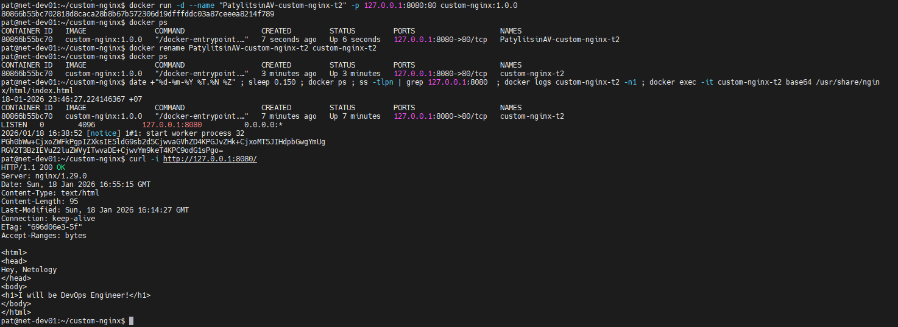
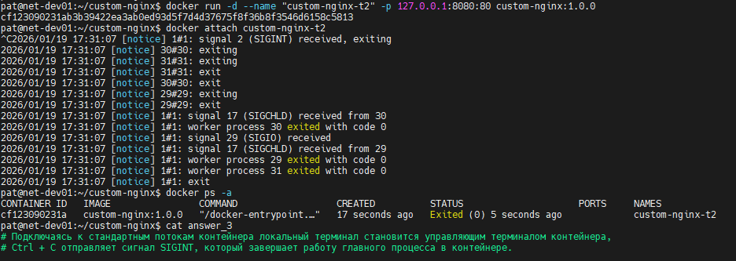
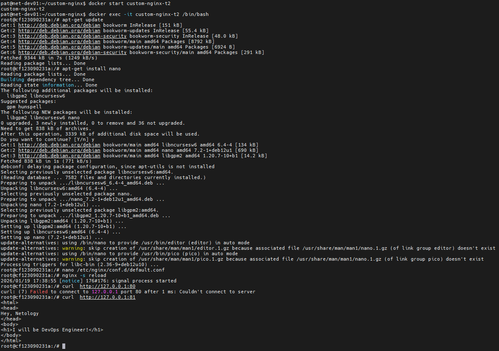
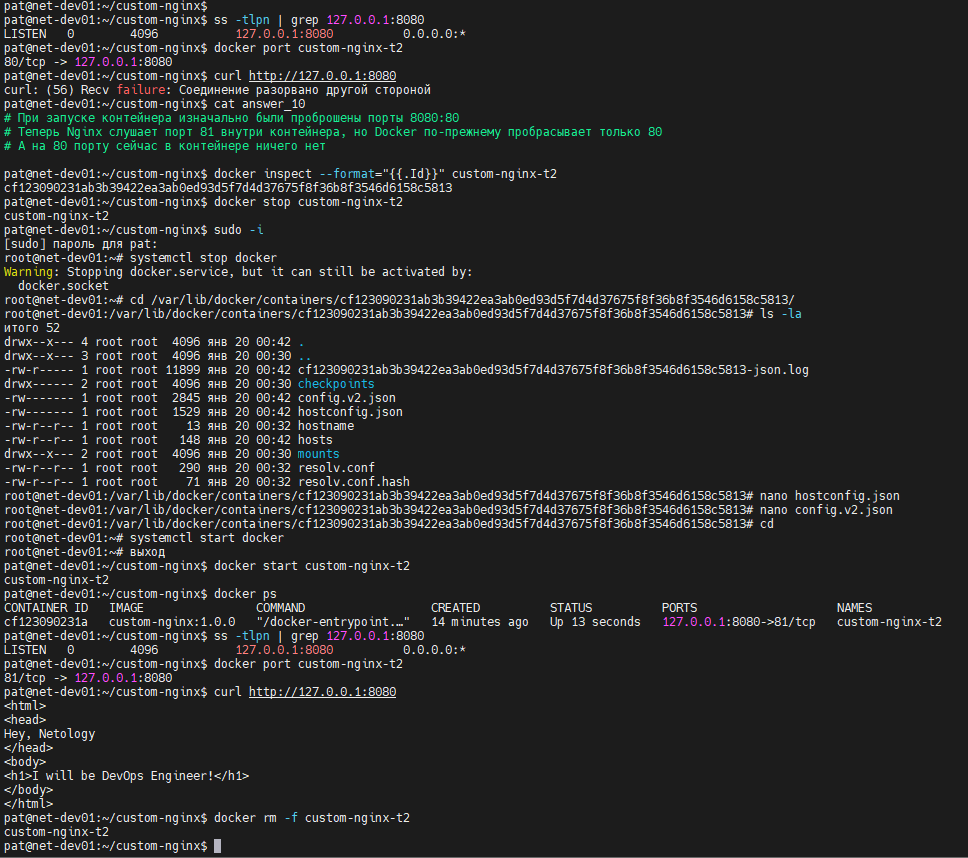
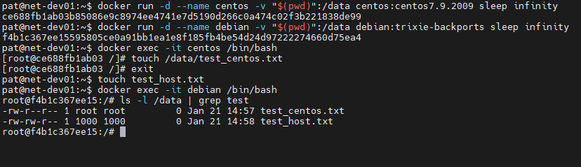
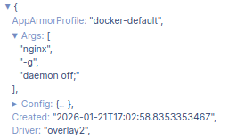

# Практическое задание по занятию "Оркестрация группой Docker контейнеров на примере Docker Compose."

## Задача 1

### Условие ответа:

> Соберите и отправьте созданный образ в свой dockerhub-репозитории c tag 1.0.0

### Ответ:

https://hub.docker.com/repository/docker/patebash/custom-nginx/general

---
## Задача 2

### Условие ответа:

> В качестве ответа приложите скриншоты консоли, где видно все введенные команды и их вывод.

### Ответ:
**Скриншоты**



**Команды для выполнения задания**

*1. Запуск контейнера в фоне*
```bash
docker run -d --name "PatylitsinAV-custom-nginx-t2" -p 127.0.0.1:8080:80 custom-nginx:1.0.0
```
*2. Переименование контейнера*
```bash
docker rename PatylitsinAV-custom-nginx-t2 custom-nginx-t2
```
*3. Проверка статуса контейнера и базовых данных*
```bash
date +"%d-%m-%Y %T.%N %Z" ; \
sleep 0.150 ; \
docker ps ; \
ss -tlpn | grep 127.0.0.1:8080 ; \
docker logs custom-nginx-t2 -n1 ; \
docker exec -it custom-nginx-t2 base64 /usr/share/nginx/html/index.html
```
*4. Проверка доступности сервера через curl*
```bash
curl http://127.0.0.1:8080/
```
---
## Задача 3

### Условие ответа:

> В качестве ответа приложите скриншоты консоли, где видно все введенные команды и их вывод.

***Необходимые пояснения к пунктам 3 и 10 отображены на скриншотах***

### Ответ:
**Скриншоты**





**Команды для выполнения задания**
```bash
docker run -d --name "custom-nginx-t2" -p 127.0.0.1:8080:80 custom-nginx:1.0.0
docker attach custom-nginx-t2
docker ps -a
docker start custom-nginx-t2
docker exec -it custom-nginx-t2 /bin/bash
cat /etc/nginx/conf.d/default.conf | grep -i listen
nginx -s reload
curl  http://127.0.0.1:80
curl  http://127.0.0.1:81
ss -tlpn | grep 127.0.0.1:8080
docker port custom-nginx-t2
curl http://127.0.0.1:8080
docker inspect --format="{{.Id}}" custom-nginx-t2
docker stop custom-nginx-t2
systemctl stop docker
cd /var/lib/docker/containers/ba3bfaac53b4078e244af76c553e51b02c389d308930a1d7a19ca1f16a0addb8/
nano hostconfig.json
nano config.v2.json
systemctl start docker
docker start custom-nginx-t2
docker ps
curl http://127.0.0.1:8080
docker rm -f custom-nginx-t2
```
---
## Задача 4

### Условие ответа:

> В качестве ответа приложите скриншоты консоли, где видно все введенные команды и их вывод.

### Ответ:
**Скриншоты**



**Команды для выполнения задания**
```bash
docker run -d --name centos -v "$(pwd)":/data centos:centos7.9.2009 sleep infinity
docker run -d --name debian -v "$(pwd)":/data debian:trixie-backports sleep infinity
docker exec -it centos /bin/bash
docker exec -it debian /bin/bash
```
---
## Задача 5

### Условие ответа:

> В качестве ответа приложите скриншоты консоли, где видно все введенные команды и их вывод, файл compose.yaml , скриншот portainer c задеплоенным компоузом.

### Ответ:

***Пояснение к пункту 7 на предупреждение:***
```markdown
WARN[0000] Found orphan containers ([task5-portainer-1]) for this project.
If you removed or renamed this service in your compose file, you can run this command with the --remove-orphans flag to clean it up
```
> Контейнер существует на хосте, но больше не привязан к текущему Compose-проекту.
> Docker Compose нашёл «осиротевший» контейнер task5-portainer-1, который больше не описан в манифесте проекта.

**Скриншоты**



**Команды для выполнения задания**
```bash
docker compose up -d
docker tag custom-nginx:1.0.0 localhost:5000/custom-nginx:latest
docker push localhost:5000/custom-nginx:latest
sudo rm compose.yaml
docker compose down
```
