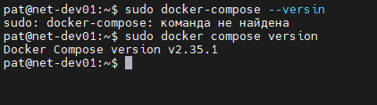
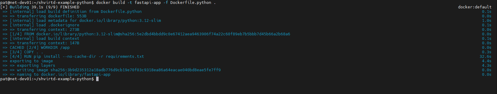

# Практическое задание по занятию "Практическое применение Docker.

## Задача 0

### Условие ответа:

> Убедитесь что у вас НЕ(!) установлен docker-compose
> Убедитесь что у вас УСТАНОВЛЕН docker compose(без тире) версии не менее v2.24.X

### Ответ:

---
## Задача 1

### Условие ответа:

> Протестируйте корректность сборки
> (Необязательная часть, *) Изучите инструкцию в проекте и запустите web-приложение без использования docker, с помощью venv. (Mysql БД можно запустить в docker run).
> (Необязательная часть, *) Изучите код приложения и добавьте управление названием таблицы через ENV переменную.

### Ответ:

[Открыть Dockerfile.python](Dockerfile.python)

---
