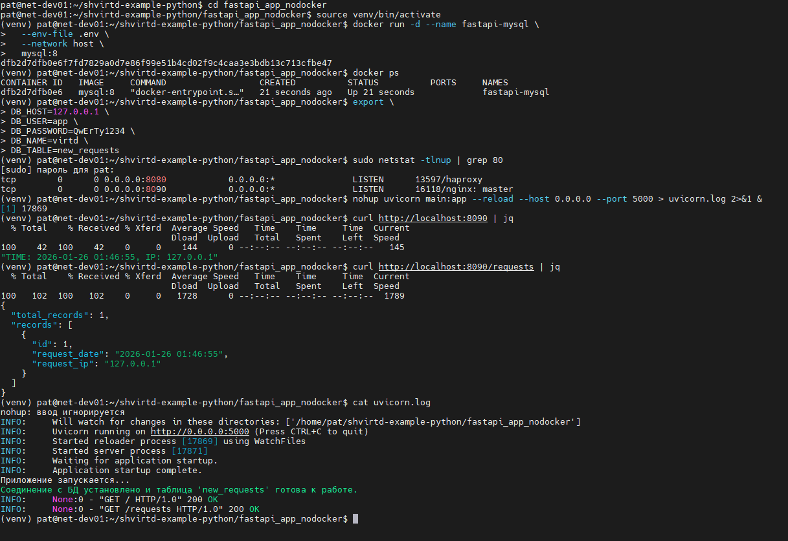
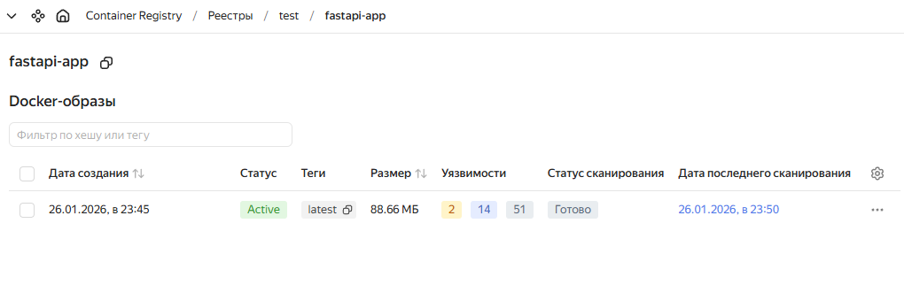
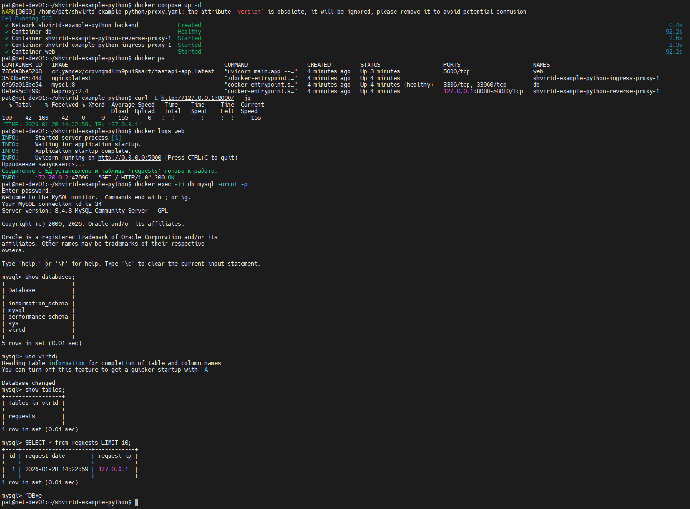
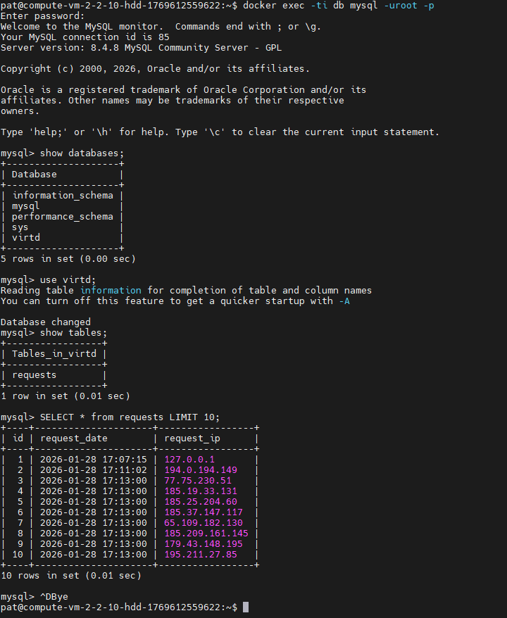
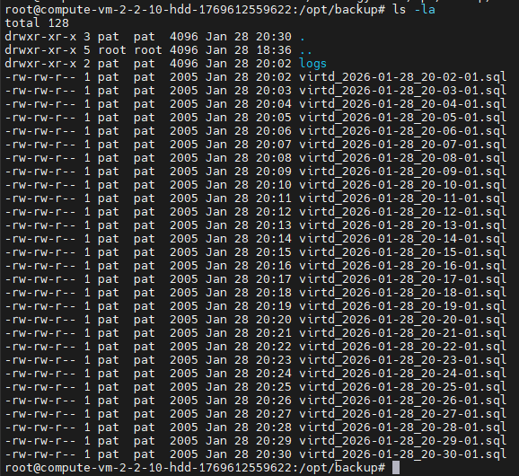
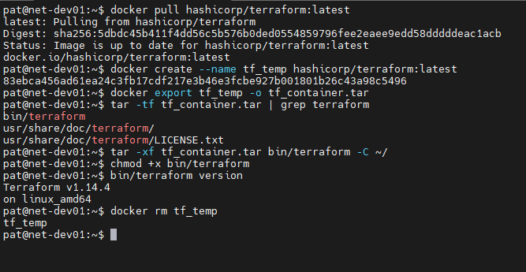
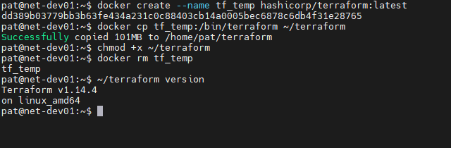

# Практическое задание по занятию "Практическое применение Docker.

## Задача 0

### Условие ответа:

> Убедитесь что у вас НЕ(!) установлен docker-compose
> Убедитесь что у вас УСТАНОВЛЕН docker compose(без тире) версии не менее v2.24.X

### Ответ:

---
## Задача 1

### Условие ответа:

> Протестируйте корректность сборки
>
> (Необязательная часть, *) Изучите инструкцию в проекте и запустите web-приложение без использования docker, с помощью venv. (Mysql БД можно запустить в docker run).
>
> (Необязательная часть, *) Изучите код приложения и добавьте управление названием таблицы через ENV переменную.

### Ответ:

[Открыть Dockerfile.python](Dockerfile.python)

**Запуск приложения без docker и добавление управлением названия таблицы:**

[Открыть main.py](fastapi_app_nodocker/main.py)

[Открыть .env](fastapi_app_nodocker/.env)

***Nginx и haproxy подняты на хосте***

[Открыть конфиги nginx](nginx_host/)

[Открыть конфиг haproxy](haproxy_host/haproxy.cfg)

---

## Задача 2

### Условие ответа:

> Загрузить образ docker в yc и просканировать.
> В качестве ответа приложите отчет сканирования.

### Ответ:

[Открыть отчет сканирования](vulnerabilities.csv)

---

## Задача 3

### Условие ответа:

> Остановите проект. В качестве ответа приложите скриншот sql-запроса.

### Ответ:

---

## Задача 4

### Условие ответа:

> Повторите SQL-запрос на сервере и приложите скриншот и ссылку на fork.

### Ответ:

[Ссылка на fork](https://github.com/Patebash/shvirtd-example-python.git)

---

## Задача 5

### Условие ответа:

> Предоставьте скрипт, cron-task и скриншот с несколькими резервными копиями в "/opt/backup"

### Ответ:

[Скрипт mysql_backup.sh](mysql_backup.sh)

[Crontask](pat)

---

## Задача 6

### Условие ответа:

> Скачайте docker образ hashicorp/terraform:latest и скопируйте бинарный файл /bin/terraform на свою локальную машину, используя dive и docker save.
>
> Предоставьте скриншоты действий .

### Ответ:

---

## Задача 6.1

### Условие ответа:

> Добейтесь аналогичного результата, используя docker cp.
>
> Предоставьте скриншоты действий .

### Ответ:

---
