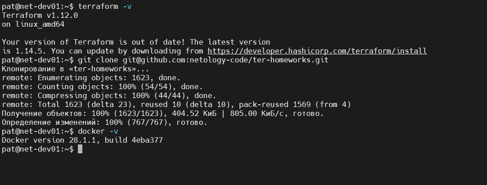
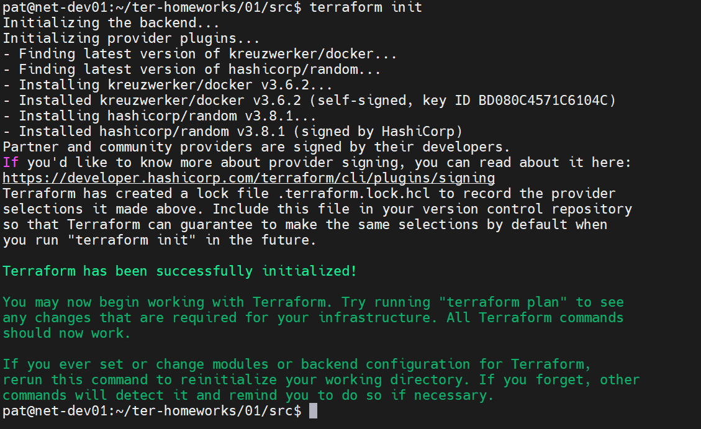

# Домашнее задание к занятию «Введение в Terraform».

## Чек-лист готовности к домашнему заданию

### Условие ответа:

> Скачайте и установите Terraform версии >=1.12.0 . Приложите скриншот вывода команды terraform --version.
> 
> Скачайте на свой ПК этот git-репозиторий. Исходный код для выполнения задания расположен в директории 01/src.
> 
> Убедитесь, что в вашей ОС установлен docker.

### Ответ:



---

## Задание 1

### Условие ответа:

> Перейдите в каталог src. Скачайте все необходимые зависимости, использованные в проекте.

### Ответ:



### Условие ответа:

> Изучите файл .gitignore. В каком terraform-файле, согласно этому .gitignore, допустимо сохранить личную, секретную информацию?(логины,пароли,ключи,токены итд)

### Ответ:

Допустимо хранить личную секретную информацию на локальной машине в файле переменных **personal.auto.tfvars**, терраформ будет подхватывать автоматически переменные из этого файла, 
при этом git будет его игнорировать и он не попадет в репозиторий.

### Условие ответа:

> Выполните код проекта. Найдите в state-файле секретное содержимое созданного ресурса random_password, пришлите в качестве ответа конкретный ключ и его значение.

### Ответ:

```
pat@net-dev01:~/ter-homeworks/01/src$ cat terraform.tfstate | grep -i result
            "result": "bA2fKyVU4jLX6NYU"
```

### Условие ответа:

> Раскомментируйте блок кода, примерно расположенный на строчках 29–42 файла main.tf. Выполните команду terraform validate. Объясните, в чём заключаются намеренно допущенные ошибки. Исправьте их.

### Ответ:

```
pat@net-dev01:~/ter-homeworks/01/src$ terraform validate
╷
│ Error: Missing name for resource
│
│   on main.tf line 23, in resource "docker_image":
│   23: resource "docker_image" {
│
│ All resource blocks must have 2 labels (type, name).
╵
╷
│ Error: Invalid resource name
│
│   on main.tf line 28, in resource "docker_container" "1nginx":
│   28: resource "docker_container" "1nginx" {
│
│ A name must start with a letter or underscore and may contain only letters, digits, underscores, and dashes.
```

```
 Error: Reference to undeclared resource
│
│   on main.tf line 30, in resource "docker_container" "nginx_container":
│   30:   name  = "example_${random_password.random_string_FAKE.resulT}"
│
│ A managed resource "random_password" "random_string_FAKE" has not been declared in the root module.
```

*Первая ошибка* говорит о том, что ресурс должен иметь два аргумента. В данном случае был указан только один "Type" и не указано "Name" ресурса.

*Вторая ошибка* говорит о том, что в Terraform имя ресурса не может начинаться с цифры. Нарушение синтаксиса языка програмирования HCL.

*Третья ошибка* сразу два замечания:
1. Ссылается на необьявленный ресурс, такого ресурсна нет **random_string_FAKE**;
2. Регистрозависимость **resulT**, HCL чувствителен к регистру.

### Условие ответа:

> Выполните код. В качестве ответа приложите: исправленный фрагмент кода и вывод команды docker ps.

### Ответ:

[Открыть main.tf](src/main.tf)

```
resource "docker_image" "nginx" {
  name         = "nginx:latest"
  keep_locally = true
}

resource "docker_container" "nginx" {
  image = docker_image.nginx.image_id
  name  = "example_${random_password.random_string.result}"

  ports {
    internal = 80
    external = 9090
  }
}
```

```
pat@net-dev01:~/ter-homeworks/01/src$ docker ps
CONTAINER ID   IMAGE          COMMAND                  CREATED          STATUS          PORTS                  NAMES
a10824e0aa16   4af177a024eb   "/docker-entrypoint.…"   58 seconds ago   Up 56 seconds   0.0.0.0:9090->80/tcp   example_bA2fKyVU4jLX6NYU

```

### Условие ответа:

> Замените имя docker-контейнера в блоке кода на hello_world. Не перепутайте имя контейнера и имя образа. Мы всё ещё продолжаем использовать name = "nginx:latest". Выполните команду terraform apply -auto-approve. Объясните своими словами, в чём может быть опасность применения ключа -auto-approve. Догадайтесь или нагуглите зачем может пригодиться данный ключ? В качестве ответа дополнительно приложите вывод команды docker ps.

### Ответ:

```
Plan: 1 to add, 0 to change, 1 to destroy.
docker_container.nginx: Destroying... [id=a10824e0aa162381e3ac05ff57dbc4d17eaea8d882fcbd19d9fc00ca34eda80b]
docker_container.hello_world: Creating...
docker_container.nginx: Destruction complete after 1s
╷
│ Error: Unable to create container: Error response from daemon: Conflict. The container name "/example_bA2fKyVU4jLX6NYU" is already in use by container "a10824e0aa162381e3ac05ff57dbc4d17eaea8d882fcbd19d9fc00ca34eda80b". You have to remove (or rename) that container to be able to reuse that name.
│
│   with docker_container.hello_world,
│   on main.tf line 28, in resource "docker_container" "hello_world":
│   28: resource "docker_container" "hello_world" {
│
╵
pat@net-dev01:~/ter-homeworks/01/src$ docker ps
CONTAINER ID   IMAGE     COMMAND   CREATED   STATUS    PORTS     NAMES
pat@net-dev01:~/ter-homeworks/01/src$
```

Выдал ошибку о том, что не может создать контейнер с таким же именем, при этом удалив контейнер nginx.
Ключ **-auto-approve** автоматически подтверждает выполнение плана без запроса yes. 
Terraform сразу применяет все изменения и может создать, изменить или удалить ресурсы. 
Что в данном случае и произошло. Выполняются изменения сразу о которых можно не подозревать.

Указанный ключ может пригодится при использовании CI/CD пайплайнов, скриптов или иной автоматизации без участия человека и интератвного ввода. 
Если использовать данный ключ, то лучше всего только на тестовых средах с пониманием того, что делаешь.

### Условие ответа:

> Уничтожьте созданные ресурсы с помощью terraform. Убедитесь, что все ресурсы удалены. Приложите содержимое файла terraform.tfstate.

### Ответ:

```
pat@net-dev01:~/ter-homeworks/01/src$ cat terraform.tfstate
{
  "version": 4,
  "terraform_version": "1.12.0",
  "serial": 13,
  "lineage": "4fc9b82d-d223-6cc4-b90f-dfaa8f0c1ac9",
  "outputs": {},
  "resources": [],
  "check_results": null
}
pat@net-dev01:~/ter-homeworks/01/src$
```

### Условие ответа:

> Объясните, почему при этом не был удалён docker-образ nginx:latest. Ответ ОБЯЗАТЕЛЬНО НАЙДИТЕ В ПРЕДОСТАВЛЕННОМ КОДЕ, а затем ОБЯЗАТЕЛЬНО ПОДКРЕПИТЕ строчкой из документации terraform провайдера docker. (ищите в классификаторе resource docker_image )

### Ответ:

[Открыть main.tf](src/main.tf)

```
resource "docker_image" "nginx" {
  name         = "nginx:latest"
  keep_locally = true
}

```

> keep_locally (Boolean) If true, then the Docker image won't be deleted on destroy operation. If this is false, it will delete the image from the docker local storage on destroy operation.

В коде значение указано true, поэтому образ не был удален локально.

---


