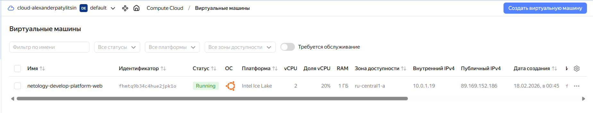
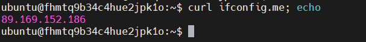
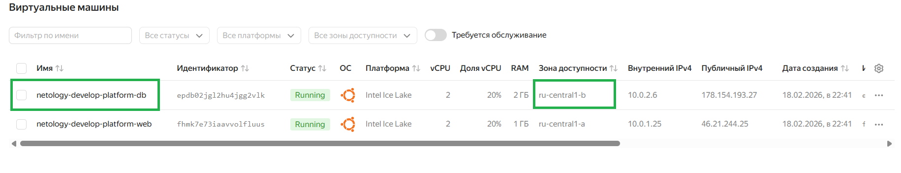

# Домашнее задание к занятию «Основы Terraform. Yandex Cloud».

## Задание 1

### Условие ответа:

> Инициализируйте проект, выполните код. Исправьте намеренно допущенные синтаксические ошибки. Ищите внимательно, посимвольно. Ответьте, в чём заключается их суть;

> скриншот ЛК Yandex Cloud с созданной ВМ, где видно внешний ip-адрес;

> скриншот консоли, curl должен отобразить тот же внешний ip-адрес;

> ответы на вопросы.

### Ответ:





```
│ error: code = FailedPrecondition desc = Platform "standart-v4" not found
│
│   with yandex_compute_instance.platform,
│   on main.tf line 15, in resource "yandex_compute_instance" "platform":
│   15: resource "yandex_compute_instance" "platform" {
```
#### Неверно указан id платформы, исправил на standard-v3 согласно инструкции https://yandex.cloud/ru/docs/compute/concepts/vm-platforms

```
│ error: code = InvalidArgument desc = the specified core fraction is not available on platform "standard-v3"; allowed core fractions: 20, 50, 100
│
│   with yandex_compute_instance.platform,
│   on main.tf line 15, in resource "yandex_compute_instance" "platform":
│   15: resource "yandex_compute_instance" "platform" {
```
#### Неверно указан аргумент для core_fraction = 5, а допустимые значения гарантированной доли CPU для данной платформы 20, 50, 100. исправил на 20.


> Ответьте, как в процессе обучения могут пригодиться параметры preemptible = true и core_fraction=5 в параметрах ВМ.


#### Прерываемая ВМ и выделенная доля CPU в процессе обучения пригодятся для акономии выделенного гранта на весь срок обучения. Маленькая доля CPU ниже стоимость VM. Забыл удалить VM, прерываемая VM остановится автоматически через 24 часа.

---

## Задание 2

### Условие ответа:

> Замените все хардкод-значения для ресурсов yandex_compute_image и yandex_compute_instance на отдельные переменные. К названиям переменных ВМ добавьте в начало префикс vm_web_ . Пример: vm_web_name.

> Объявите нужные переменные в файле variables.tf, обязательно указывайте тип переменной. Заполните их default прежними значениями из main.tf.

> Проверьте terraform plan. Изменений быть не должно.

### Ответ:

[Открыть main.tf](src/main.tf)

[Открыть variables.tf](src/variables.tf)

---

## Задание 3

### Условие ответа:

> Создайте в корне проекта файл 'vms_platform.tf' . Перенесите в него все переменные первой ВМ.
> Скопируйте блок ресурса и создайте с его помощью вторую ВМ в файле main.tf: "netology-develop-platform-db" , cores  = 2, memory = 2, core_fraction = 20.
> Объявите её переменные с префиксом vm_db_ в том же файле ('vms_platform.tf'). ВМ должна работать в зоне "ru-central1-b"
> Примените изменения.

### Ответ:



[Открыть main.tf](src/main.tf)

[Открыть vms_platform.tf](src/vms_platform.tf)

---

## Задание 4

### Условие ответа:

> Объявите в файле outputs.tf один output , содержащий: instance_name, external_ip, fqdn для каждой из ВМ в удобном лично для вас формате.(без хардкода!!!)
> Примените изменения.
> В качестве решения приложите вывод значений ip-адресов команды terraform output.

### Ответ:

```
$ terraform output
vm_info = {
  "db" = {
    "external_ip" = "178.154.193.27"
    "fqdn" = "epdb02jgl2hu4jgg2vlk.auto.internal"
    "instance_name" = "netology-develop-platform-db"
  }
  "web" = {
    "external_ip" = "46.21.244.25"
    "fqdn" = "fhmk7e73iaavvolfluus.auto.internal"
    "instance_name" = "netology-develop-platform-web"
  }
}
```

[Открыть outputs.tf](src/outputs.tf)

---
