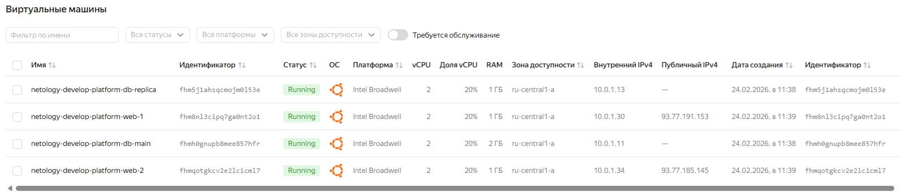

# Домашнее задание к занятию «Управляющие конструкции в коде Terraform».

## Задание 1

### Условие ответа:

> Изучите проект.
> Инициализируйте проект, выполните код.
> Приложите скриншот входящих правил «Группы безопасности» в ЛК Yandex Cloud .

### Ответ:


---

## Задание 2

### Условие ответа:

> Создайте файл count-vm.tf. Опишите в нём создание двух одинаковых ВМ web-1 и web-2 (не web-0 и web-1) с минимальными параметрами, используя мета-аргумент count loop. Назначьте ВМ созданную в первом задании группу безопасности.(как это сделать узнайте в документации провайдера yandex/compute_instance )
Создайте файл for_each-vm.tf. Опишите в нём создание двух ВМ для баз данных с именами "main" и "replica" разных по cpu/ram/disk_volume , используя мета-аргумент for_each loop. Используйте для обеих ВМ одну общую переменную типа:
```
variable "each_vm" {
  type = list(object({  vm_name=string, cpu=number, ram=number, disk_volume=number }))
}
```
> При желании внесите в переменную все возможные параметры. 4. ВМ из пункта 2.1 должны создаваться после создания ВМ из пункта 2.2. 5. Используйте функцию file в local-переменной для считывания ключа ~/.ssh/id_rsa.pub и его последующего использования в блоке metadata, взятому из ДЗ 2. 6. Инициализируйте проект, выполните код.

### Ответ:

[Открыть count-vm.tf](src/count-vm.tf)

[Открыть for_each-vm.tf](src/for_each-vm.tf)




---
