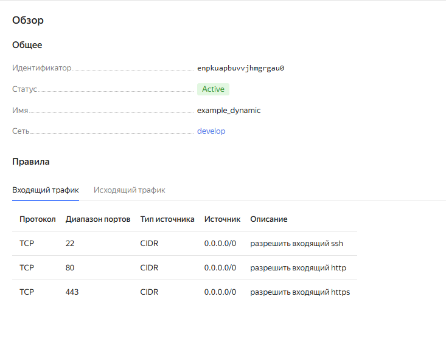

# Домашнее задание к занятию «Управляющие конструкции в коде Terraform».

## Задание 1

### Условие ответа:

> Изучите проект.
> Инициализируйте проект, выполните код.
> Приложите скриншот входящих правил «Группы безопасности» в ЛК Yandex Cloud .

### Ответ:

---

