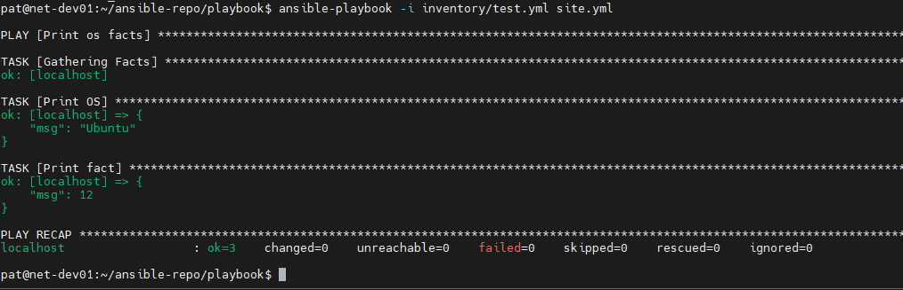
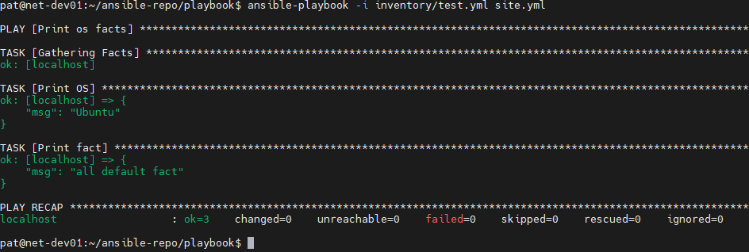
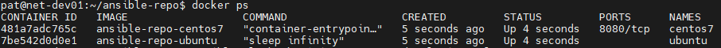
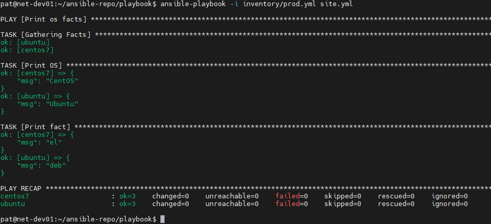
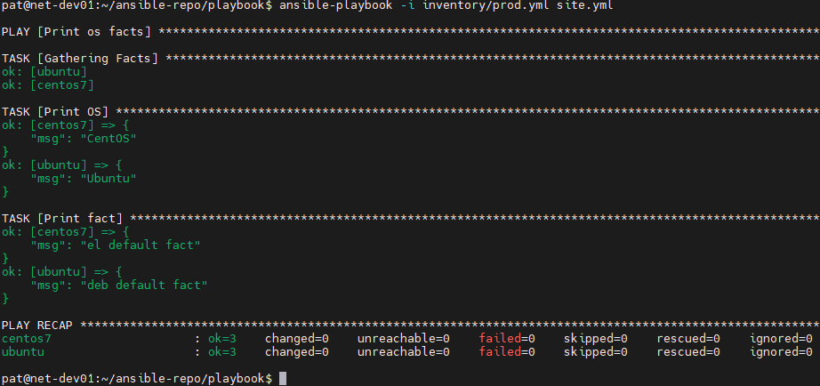
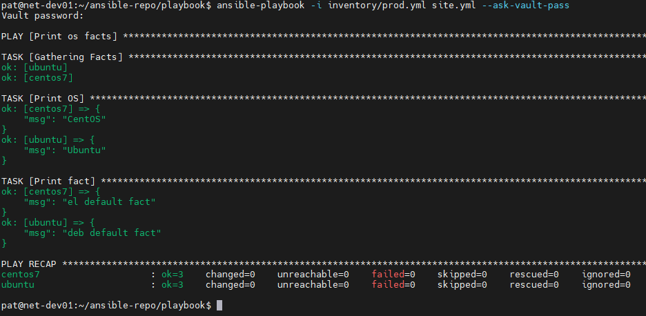
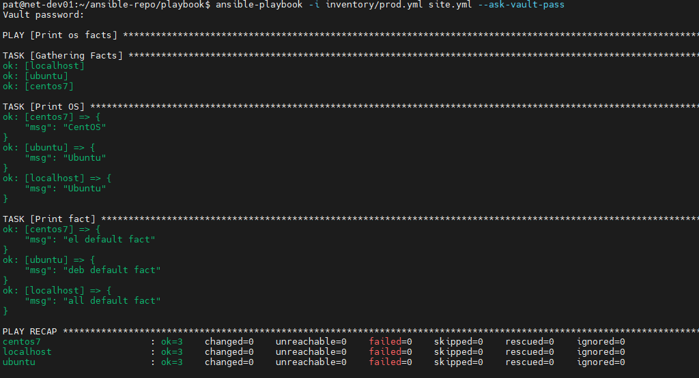

# Домашнее задание к занятию 1 «Введение в Ansible»

## Задание 1

### Условие ответа:

> Попробуйте запустить playbook на окружении из test.yml, зафиксируйте значение, которое имеет факт some_fact для указанного хоста при выполнении playbook.

### Ответ:

---
## Задание 2

### Условие ответа:

> Найдите файл с переменными (group_vars), в котором задаётся найденное в первом пункте значение, и поменяйте его на all default fact.

### Ответ:

---
## Задание 3

### Условие ответа:

> Воспользуйтесь подготовленным (используется docker) или создайте собственное окружение для проведения дальнейших испытаний.

### Ответ:

---
## Задание 4

### Условие ответа:

> Проведите запуск playbook на окружении из prod.yml. Зафиксируйте полученные значения some_fact для каждого из managed host.

### Ответ:

---
## Задание 5,6

### Условие ответа:

> Добавьте факты в group_vars каждой из групп хостов так, чтобы для some_fact получились значения: для deb — deb default fact, для el — el default fact.
> Повторите запуск playbook на окружении prod.yml. Убедитесь, что выдаются корректные значения для всех хостов.

### Ответ:

---
## Задание 7,8

### Условие ответа:

> При помощи ansible-vault зашифруйте факты в group_vars/deb и group_vars/el с паролем netology.
> Запустите playbook на окружении prod.yml. При запуске ansible должен запросить у вас пароль. Убедитесь в работоспособности.

### Ответ:

---
## Задание 9,10,11

### Условие ответа:

> Посмотрите при помощи ansible-doc список плагинов для подключения. Выберите подходящий для работы на control node.
> В prod.yml добавьте новую группу хостов с именем local, в ней разместите localhost с необходимым типом подключения.
> Запустите playbook на окружении prod.yml. При запуске ansible должен запросить у вас пароль. Убедитесь, что факты some_fact для каждого из хостов определены из верных group_vars.

### Ответ:

