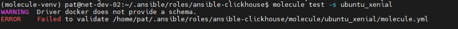
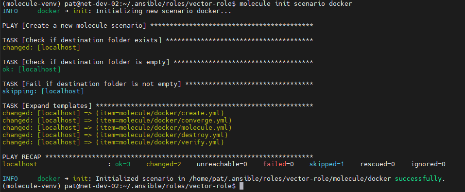
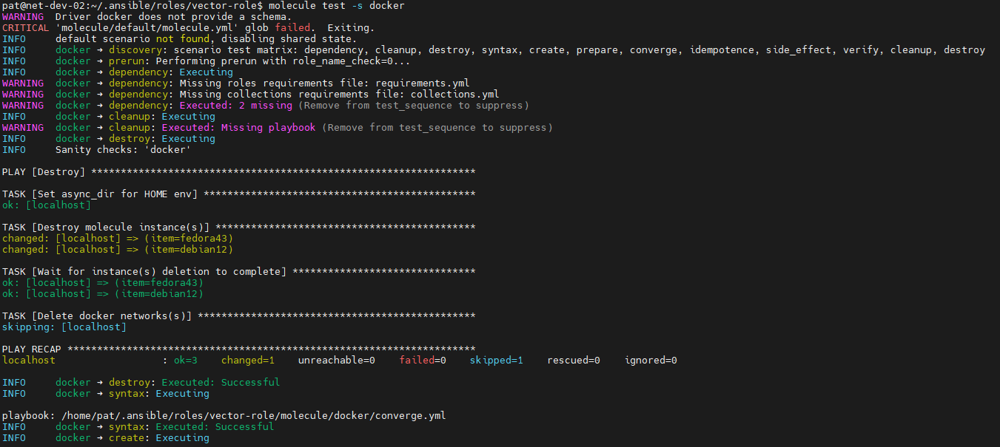
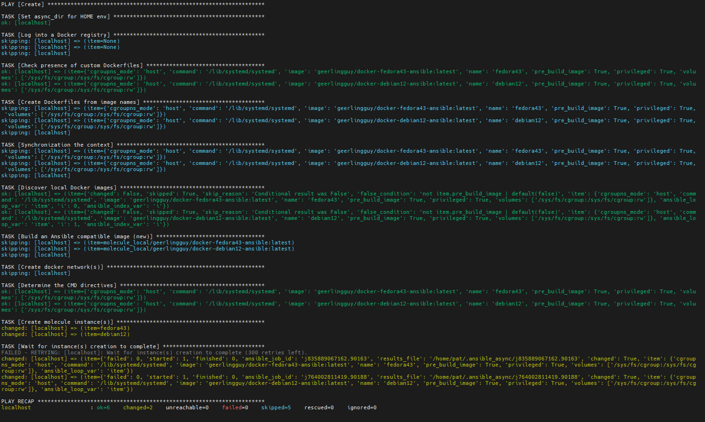
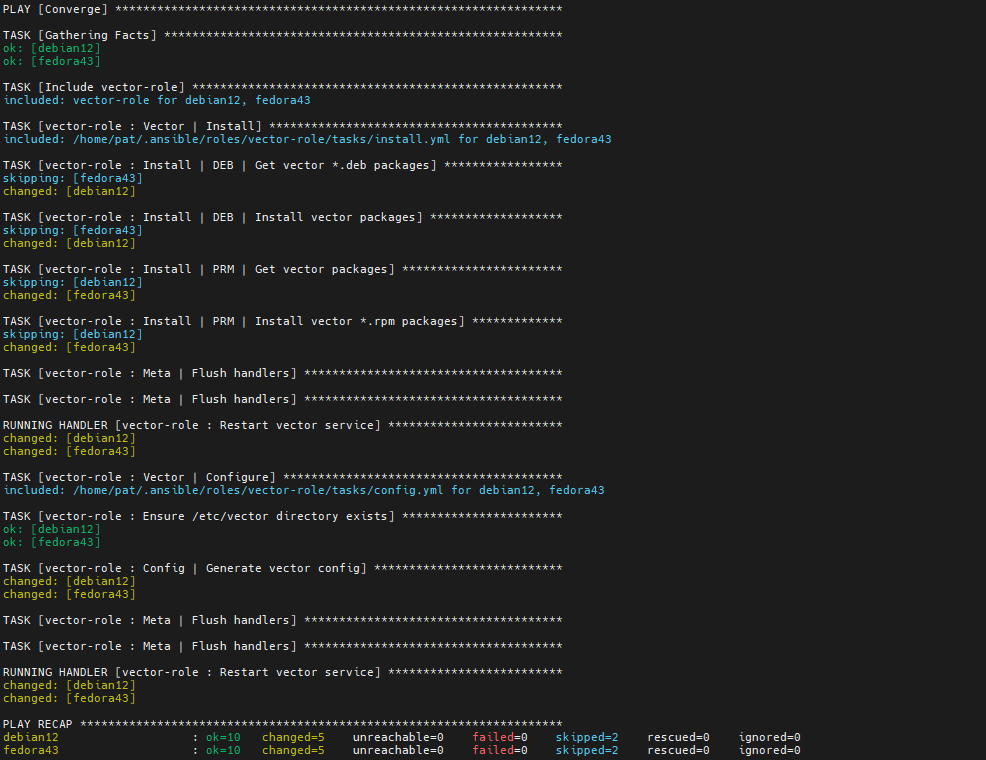
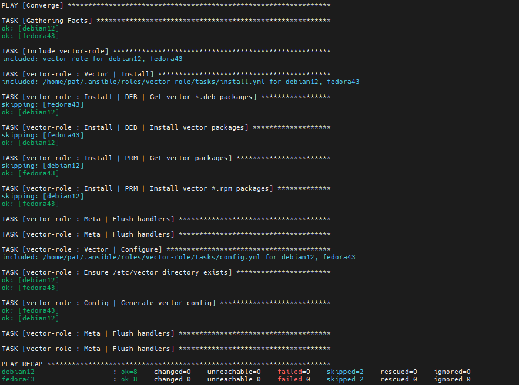
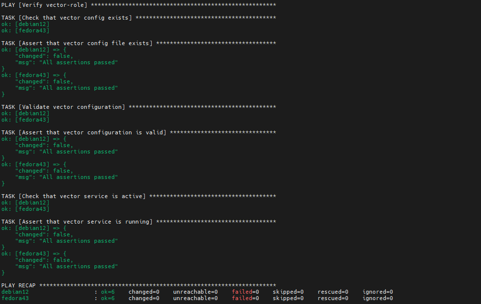
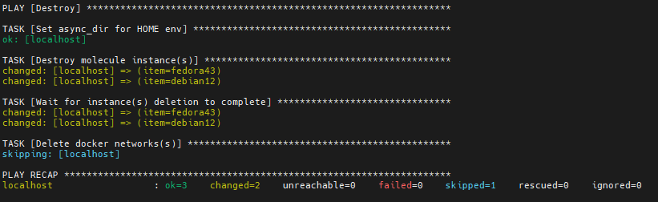

## Домашнее задание к занятию 5 «Тестирование roles»

### Установленные версии ПО:

* ansible-core 2.20.4
* molecule 26.3.0
* molecule-podman 2.0.3
* molecule-docker 2.1.0
* ansible-lint 26.3.0

### Molecule

1. Команда выдала ошибку по причине разности версий molecule. Структура molecule.yml в роли clickhouse устарела.



2. Изменился синтаксис команды в новых версиях molecule:



3-5. В роли используется systemd, поэтому для тестирования были использованы следующие образы:

```
geerlingguy/docker-debian12-ansible:latest
geerlingguy/docker-fedora43-ansible:latest
```

#### Destroy



#### Create



#### Converge



#### Converge-idempotence



#### Verify



#### Destroy



6. Ссылка на тег коммита vector-role https://github.com/Patebash/vector-role/releases/tag/v1.1.0
