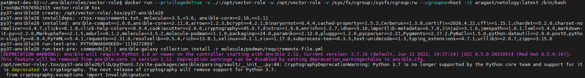
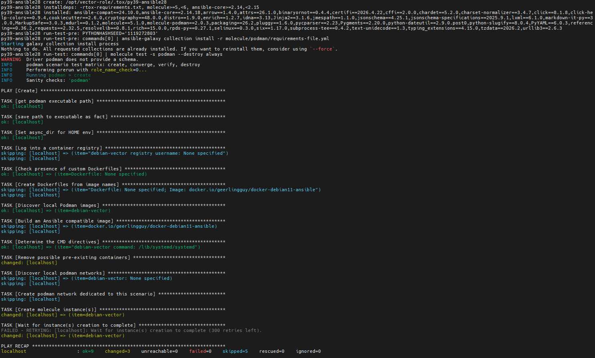
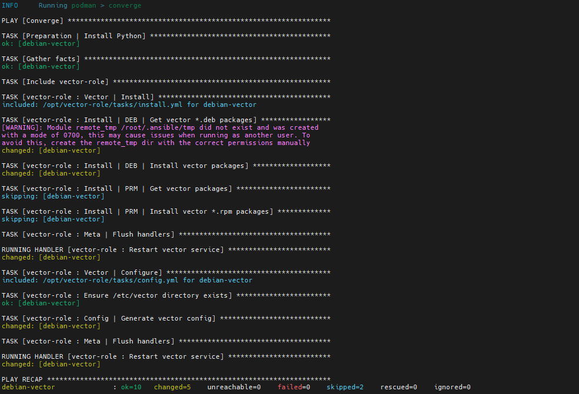
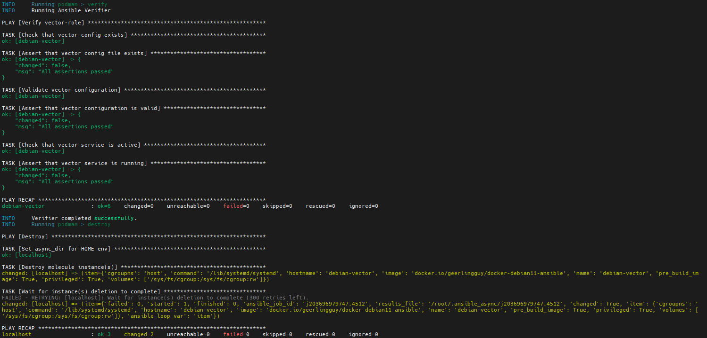
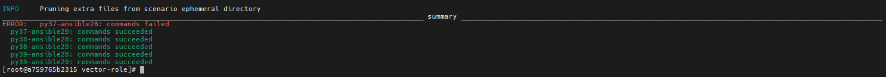

## Домашнее задание к занятию 5 «Тестирование roles»

### Установленные версии ПО:

* ansible-core 2.20.4
* molecule 26.3.0
* molecule-podman 2.0.3
* molecule-docker 2.1.0
* ansible-lint 26.3.0

### Molecule

1. Команда выдала ошибку по причине разности версий molecule. Структура molecule.yml в роли clickhouse устарела.


2. Изменился синтаксис команды в новых версиях molecule:


3-5. В роли используется systemd, поэтому для тестирования были использованы следующие образы:

```
geerlingguy/docker-debian12-ansible:latest
geerlingguy/docker-fedora43-ansible:latest
```

#### Destroy


#### Create


#### Converge


#### Converge-idempotence


#### Verify


#### Destroy


6. Ссылка на версию [vector-role](https://github.com/Patebash/vector-role/tree/v1.1.0) с ценарием docker.

### Tox

1-6. При первом запускей tox завершился ошибками из-за конфликта зависимостей. 
Сборка **py37-ansible28** падает, потому что **Python 3.7** уже не поддерживается современными версиями Ansible (начиная с 2.12+). Предупреждение **CryptographyDeprecationWarning** указывает на использование устаревшего Python и зависимостей, которые больше не поддерживаются. Дополнительно, устаревшая версия ansible-galaxy приводит к ошибкам при установке зависимостей из-за несовместимости API.

Отредактировал tox.ini, прописал зависимости определенных версий пакетов.



Так как вывод достаточно большой, приложил скрины одно из сценария, а именно **py39-ansible28**:





Так же прикладываю итоговый результат выполнения тестирования:



7. Ссылка на версию [vector-role](https://github.com/Patebash/vector-role/tree/v1.2.0) с ценарием podman.
