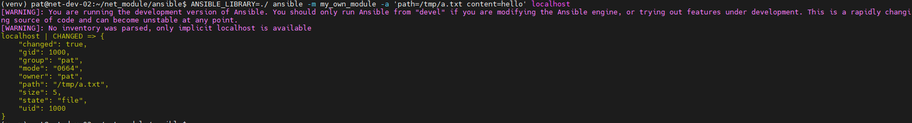
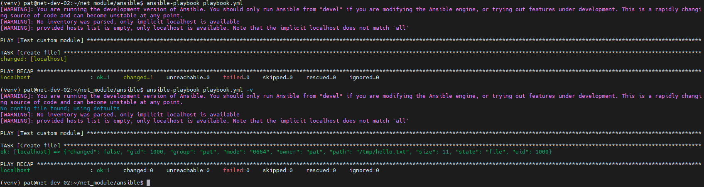
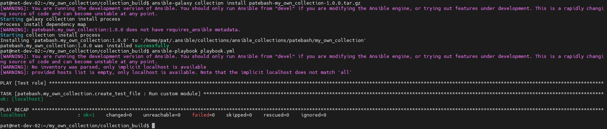

## Домашнее задание к занятию 6 «Создание собственных модулей»

### Описание выполнения ДЗ

Cоздан собственный Ansible-модуль, который создаёт файл на удалённом хосте с заданным путём и содержимым, проверен его локальный запуск и идемпотентность через playbook. 
Далее модуль и логика были оформлены в **Ansible collection** и **role**, добавлена документация, собран архив коллекции, после чего она установлена из локального файла и успешно протестирована через playbook на работоспособность.

---

### Скриншоты и шаги выполнения

1. Проверка module на исполняемость локально:

2. Проверка через playbook на идемпотентность:

3. Установка collection из локального архива: ansible-galaxy collection install <archivename>.tar.gz

---

Ссылка на коллекцию [collection](https://github.com/Patebash/my_own_collection/tree/v1.0.0)

Ссылка на архив [collection_build](https://github.com/Patebash/my_own_collection/blob/v1.0.0/collection_build/patebash-my_own_collection-1.0.0.tar.gz)

