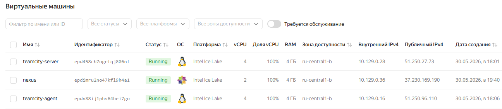
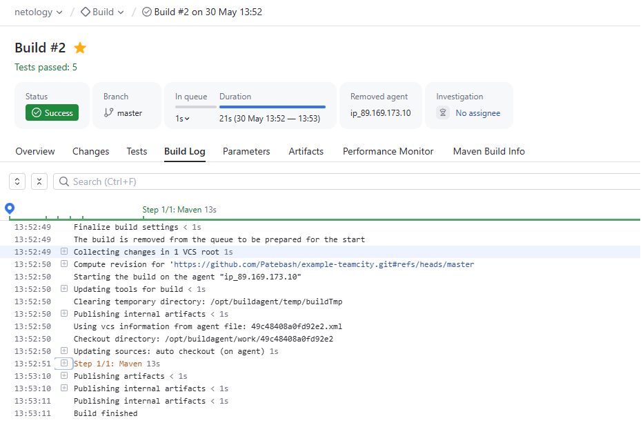
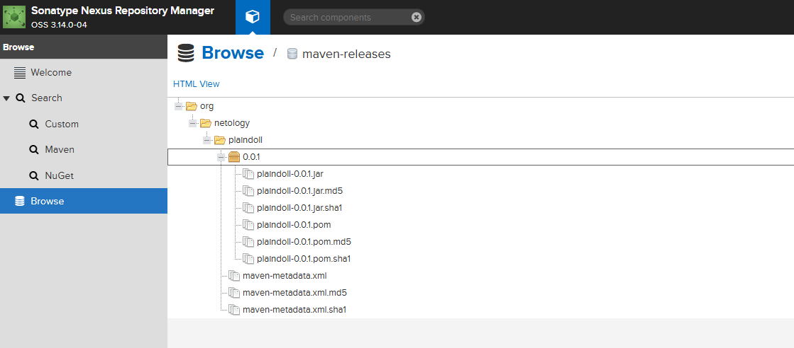
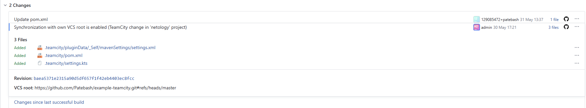
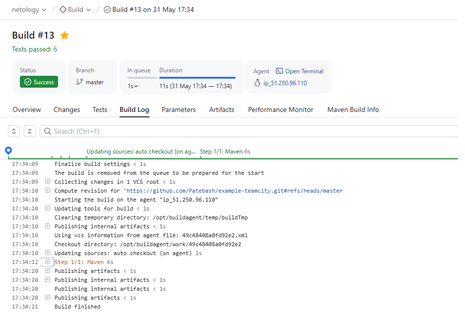
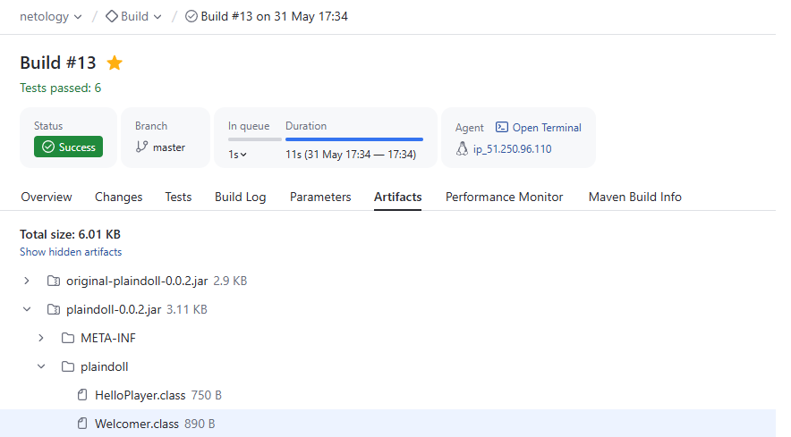

## Домашнее задание к занятию 11 «Teamcity»

### Подготовка к выполнению

1. Создать/развернуть VM для работы с TeamCity и Nexus

---

### Скриншоты и шаги выполнения

1-7 пункты. Запустите сборку по master, убедитесь, что всё прошло успешно и артефакт появился в nexus:

8 пункт. Мигрируйте build configuration в репозиторий:

Ссылка на сборку [build configuration](https://github.com/Patebash/example-teamcity/tree/master/.teamcity)

9-19 пункты. Создана отдельная ветка, добавлен новый метод в класс Welkomer, выполнен merge в master.

*Проведена контрольная сборка проекта:*

*Собирается .jar в артефакты сборки:*

Ссылка на репозиторий проекта [project](https://github.com/Patebash/example-teamcity)
