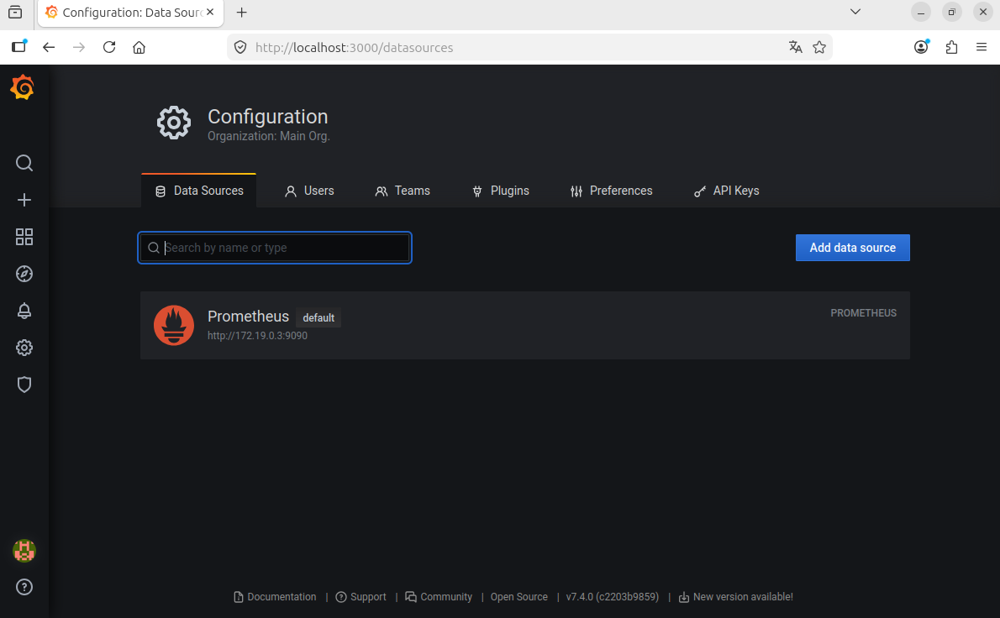
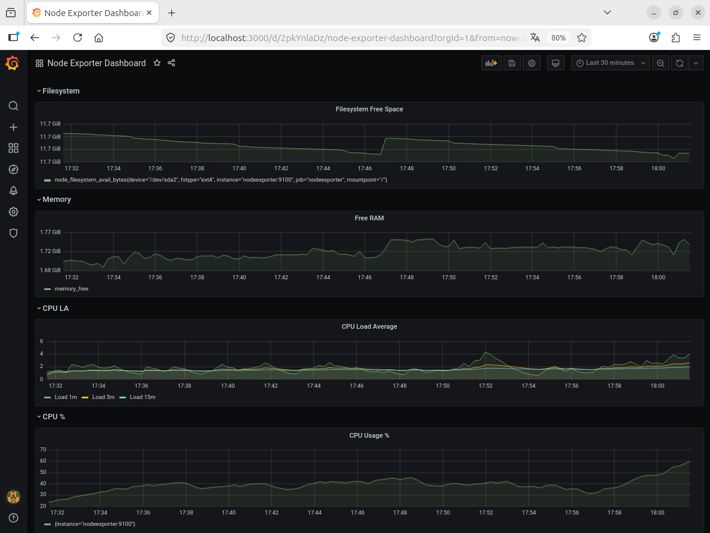

# Домашнее задание к занятию 14 «Средство визуализации Grafana»

## Задание 1:

> Запустите связку prometheus-grafana. Подключите поднятый вами prometheus, как источник данных.

### Ответ:



---

## Задание 2:

> Для решения задания приведите promql-запросы для выдачи метрик, а также скриншот получившейся Dashboard.

### Ответ:

 #### *Promql-запросы:*

```promql
node_filesystem_avail_bytes{fstype!="tmpfs",fstype!="overlay"}
```
```promql
node_memory_MemAvailable_bytes
```
```promql
node_load1
node_load5
node_load15
```
```promql
100 - (avg by(instance) (rate(node_cpu_seconds_total{mode="idle"}[5m])) * 100)
```



---
