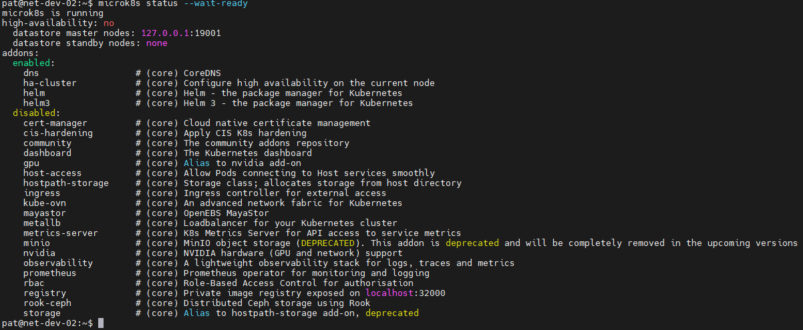
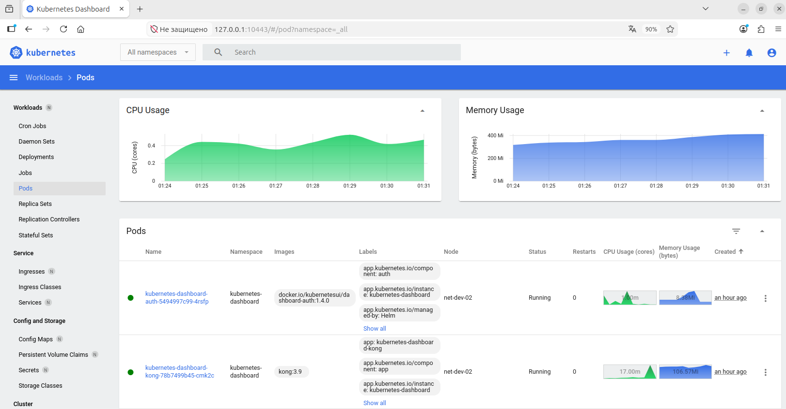
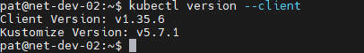
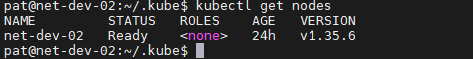
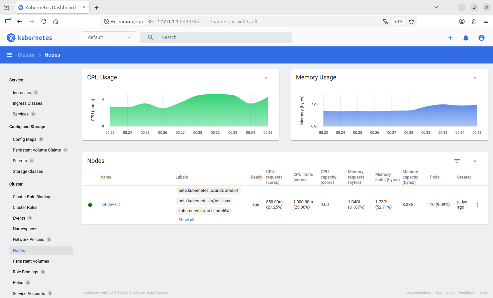

# Домашнее задание к занятию «Kubernetes. Причины появления. Команда kubectl»

## Задание 1. Установка MicroK8S:

1. Установить MicroK8S на локальную машину или на удалённую виртуальную машину.
2. Установить dashboard.
3. Сгенерировать сертификат для подключения к внешнему ip-адресу.

## Ответ:

**Установил Micrik8s:**

**Установил Dashboard:**

*Сертификат был сгенерирован и внешний IP указан в SAN  автоматически.*

---

## Задание 2. Установка и настройка локального kubectl

1. Установить на локальную машину kubectl.
2. Настроить локально подключение к кластеру.
3. Подключиться к дашборду с помощью port-forward.

## Ответ:

**Установил kubectl:**

**Локальное подключение к кластеру:**

**Подключение к дашборду с помощью port-forward:**

