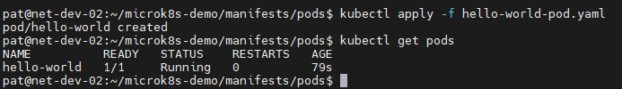
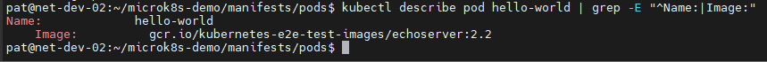
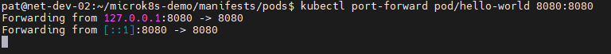
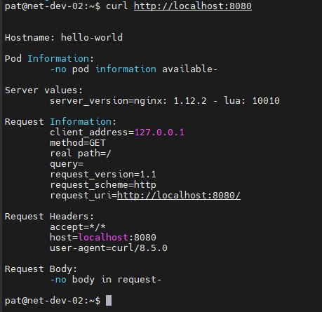

# Домашнее задание к занятию «Базовые объекты K8S»

## Задание 1. Создать Pod с именем hello-world
> 1. Создать манифест (yaml-конфигурацию) Pod.
> 2. Использовать image - gcr.io/kubernetes-e2e-test-images/echoserver:2.2.
> 3. Подключиться локально к Pod с помощью kubectl port-forward и вывести значение (curl или в браузере).

## Ответ:

**1. Создал манифест:**

[hello-world-pod.yaml](manifests/hello-world-pod.yaml)

**2. Использовал image - gcr.io/kubernetes-e2e-test-images/echoserver:2.2:**

**3. Пробросил порт и проверил curl:**

---
