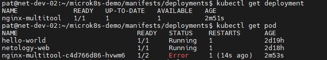
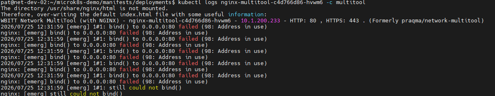
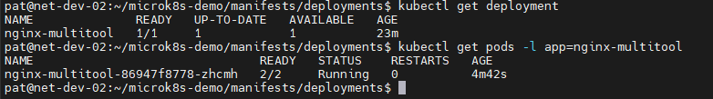
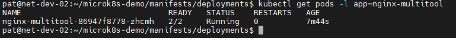
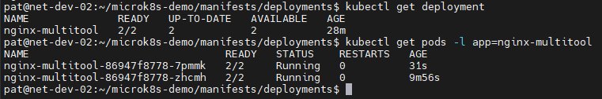
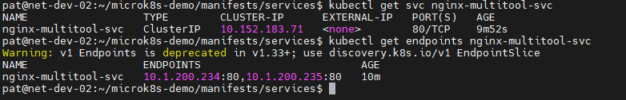
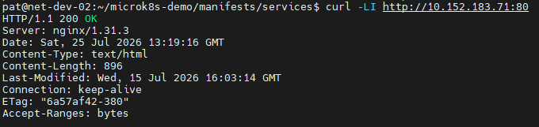
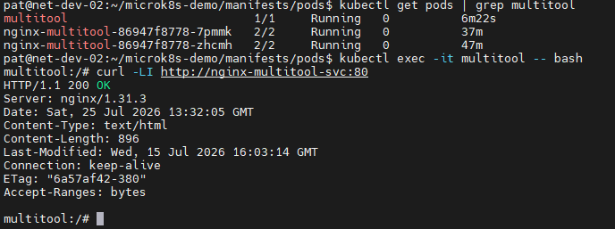

# Домашнее задание к занятию «Запуск приложений в K8S»

## Задание 1. Создать Deployment и обеспечить доступ к репликам приложения из другого Pod
> 1. Создать Deployment приложения, состоящего из двух контейнеров — nginx и multitool. Решить возникшую ошибку.
> 2. После запуска увеличить количество реплик работающего приложения до 2.
> 3. Продемонстрировать количество подов до и после масштабирования.
> 4. Создать Service, который обеспечит доступ до реплик приложений из п.1.
> 5. Создать отдельный Pod с приложением multitool и убедиться с помощью curl, что из пода есть доступ до приложений из п.1.

## Ответ:

**1. Создать Deployment приложения, состоящего из двух контейнеров — nginx и multitool. Решить возникшую ошибку.**

*Создал Deployment:*

[deployment.yaml](manifests/deployments/deployment.yaml)

*Получил ошибку, что порт 80 уже используется контейнером nginx:*

*Указал другой порт в манифесте deployment для контейнера multitool, после чего контейнеры запустились успешно:*

**2,3. После запуска увеличить количество реплик работающего приложения до 2. Продемонстрировать количество подов до и после масштабирования.**

*Количество подов до:*

*Увеличил количество реплик, количество подов увеличилось:*

**4. Создать Service, который обеспечит доступ до реплик приложений из п.1.**

*Создал сервисе и убедился в количестве доступных endpoints:*

[deployment-service.yaml](manifests/services/deployment-service.yaml)

**5. Создать отдельный Pod с приложением multitool и убедиться с помощью curl, что из пода есть доступ до приложений из п.1.**

*Создал под, зашел в него и убедился что nginx доступен:*

[multitool-pod.yaml](manifests/pods/multitool-pod.yaml)

---
