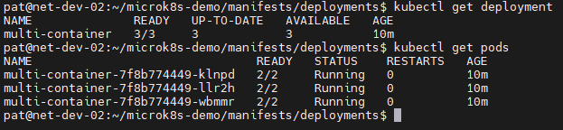
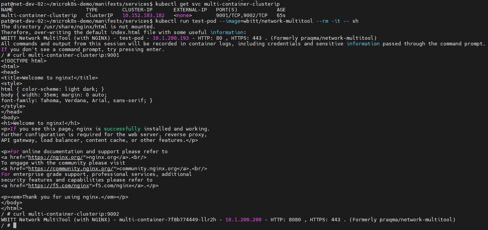
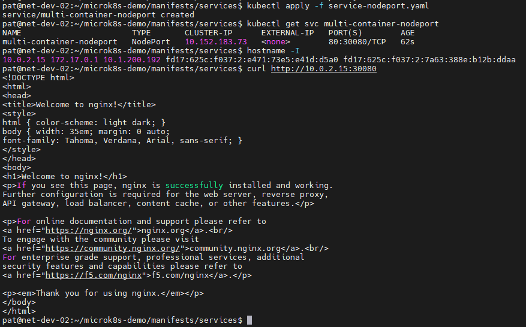
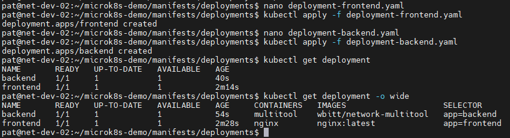
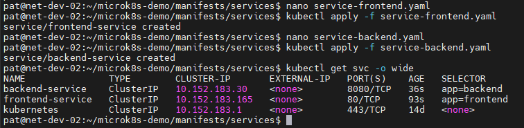
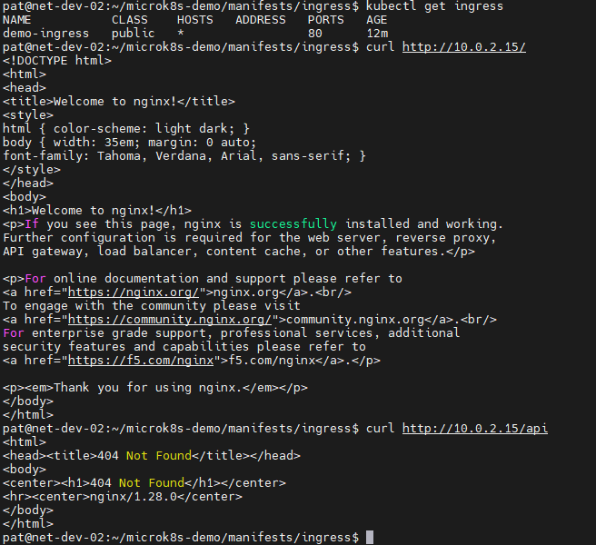

# Домашнее задание к занятию «Сетевое взаимодействие в Kubernetes»

## Задание 1: Настройка Service (ClusterIP и NodePort)
> 1. Создать Deployment с двумя контейнерами;
> 2. Создать Service типа ClusterIP;
> 3. Проверить доступность изнутри кластера;
> 4. Создать Service типа NodePort для доступа к nginx снаружи;
> 5. Проверить доступ с локального компьютера.

## Ответ:

**1. Создать Deployment с двумя контейнерами**

[deployment-multi-container.yaml](manifests/deployments/deployment-multi-container.yaml)

**2,3. Создать Service типа ClusterIP и Проверить доступность изнутри кластера**

[service-clusterip.yaml](manifests/services/service-clusterip.yaml)

**4,5. Создать Service типа NodePort для доступа к nginx снаружи и Проверить доступ с локального компьютера.**

[service-nodeport.yaml](manifests/services/service-nodeport.yaml)

---

## Задание 2: Настройка Ingress
> 1. Развернуть два Deployment;
> 2. Создать Service для каждого приложения;
> 3. Включить Ingress-контроллер;
> 4. Создать Ingress, который:
>    * Открывает frontend по пути /;
>    * Открывает backend по пути /api.
> 5. Проверить доступность.

**1. Развернуть два Deployment**

[deployment-frontend.yaml](manifests/deployments/deployment-frontend.yaml)

[deployment-backend.yaml](manifests/deployments/deployment-backend.yaml)

**2. Создать Service для каждого приложения**

[service-frontend.yaml](manifests/services/service-frontend.yaml)

[service-backend.yaml](manifests/services/service-backend.yaml)

**3. Включить Ingress-контроллер**

**4,5. Создать Ingress, который: Открывает frontend по пути /; Открывает backend по пути /api. Проверить доступность.**

[ingress.yaml](manifests/ingress/ingress.yaml)

