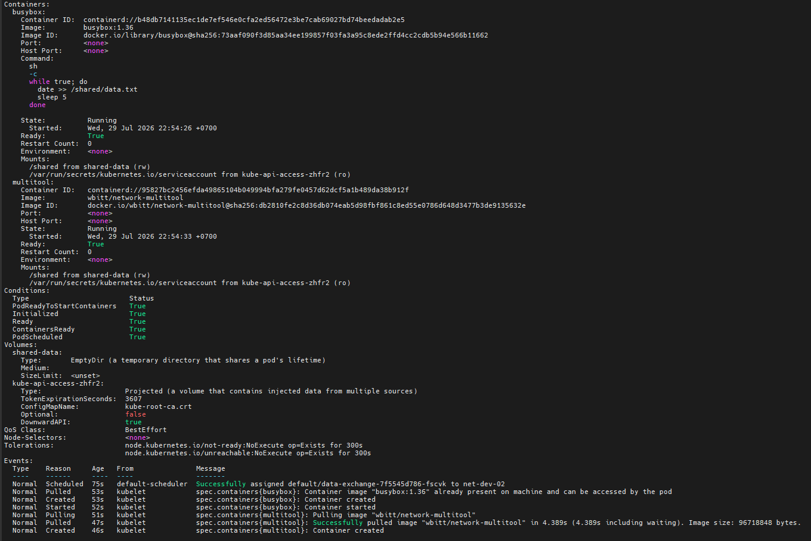
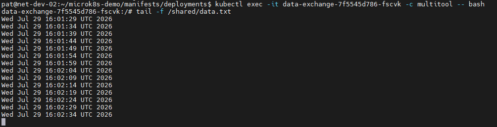
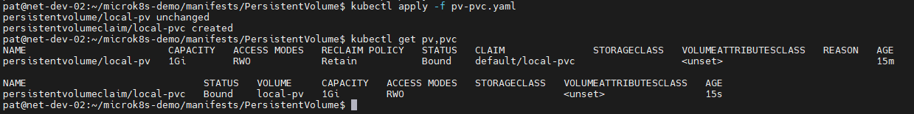
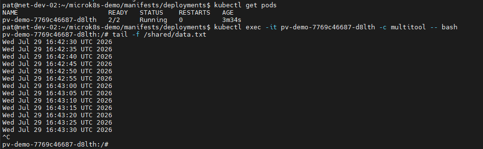
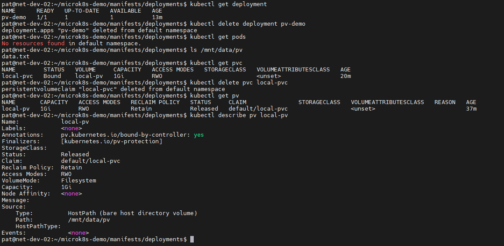
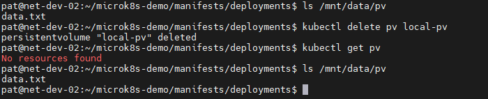

# Домашнее задание к занятию «Хранение в K8s»

## Задание 1. Volume: обмен данными между контейнерами в поде
> Создать Deployment приложения, состоящего из двух контейнеров, обменивающихся данными.
>
> Шаги выполнения:
> 1. Создать Deployment приложения, состоящего из контейнеров busybox и multitool;
> 2. Настроить busybox на запись данных каждые 5 секунд в некий файл в общей директории;
> 3. Обеспечить возможность чтения файла контейнером multitool.

## Ответ:

[containers-data-exchange.yaml](manifests/deployments/containers-data-exchange.yaml)

---

## Задание 2. PV, PVC
> Создать Deployment приложения, использующего локальный PV, созданный вручную.
>
> Шаги выполнения:
> 1. Создать Deployment приложения, состоящего из контейнеров busybox и multitool, использующего созданный ранее PVC;
> 2. Создать PV и PVC для подключения папки на локальной ноде, которая будет использована в поде;
> 3. Продемонстрировать, что контейнер multitool может читать данные из файла в смонтированной директории, в который busybox записывает данные каждые 5 секунд;
> 4. Удалить Deployment и PVC. Продемонстрировать, что после этого произошло с PV. Пояснить, почему. (Используйте команду kubectl describe pv);
> 5. Продемонстрировать, что файл сохранился на локальном диске ноды. Удалить PV. Продемонстрировать, что произошло с файлом после удаления PV. Пояснить, почему.

## Ответ:

**1. Создал Deployment, состоящего из контейнеров busybox и multitool, с указанием PVC:**

[deployment-pv.yaml](manifests/deployments/deployment-pv.yaml)

**2. Создал PV и PVC для подключения папки на локальной ноде:**

[pv-pvc.yaml](manifests/PersistentVolume/pv-pvc.yaml)

**3. Контейнер multitool успешно читает данные из файла в смонтированной директории, в который busybox записывает данные каждые 5 секунд:**

**4. Удалил Deployment и PVC. После этого PV перешел в статус Released.**

*Пояснение: PVC был удален, поэтому PV больше не используется никаким приложением. Благодаря политике **persistentVolumeReclaimPolicy: Retain** Kubernetes не удалил PV и не очистил данные, а перевел его в состояние Released*

**5. Файл сохранился на локальном диске ноды. Удалил PV.**

*Пояснение: Использовался тип **hostPath**, который указывает на существующий каталог локальной файловой системы узла. Удаление объекта PersistentVolume из Kubernetes удаляет только запись о ресурсе в API Kubernetes, но не удаляет сам каталог и его содержимое на диске.*

---
