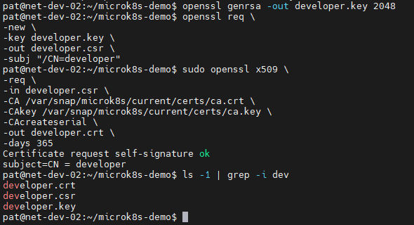
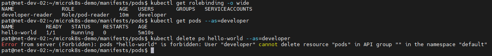

# Домашнее задание к занятию «Настройка приложений и управление доступом в Kubernetes»

## Задание 1: Работа с ConfigMaps
> Развернуть приложение (nginx + multitool), решить проблему конфигурации через ConfigMap и подключить веб-страницу.
> 
> Шаги выполнения:
>
> 1. Создать Deployment с двумя контейнерами:
> * nginx;
> * multitool.
>
> 2. Подключить веб-страницу через ConfigMap;
> 3. Проверить доступность.

## Ответ:

*Создал Deployment, создал Configmap и проверил доступность страницы index.html:*


[deployment.yaml](manifests/deployments/deployment.yaml)

[configmap-web.yaml](manifests/configmaps/configmap-web.yaml)

---

## Задание 2: Настройка HTTPS с Secrets
> Развернуть приложение с доступом по HTTPS, используя самоподписанный сертификат.
>
> Шаги выполнения
> 1. Сгенерировать SSL-сертификат;
> 2. Создать Secret;
> 3. Настроить Ingress;
> 4. Проверить HTTPS-доступ.

## Ответ:

*Создал Secret, Ingress, Service и проверил доступность страницы index.html по https с использованием SSL-сертификата:*


[secret-tls.yaml](manifests/secret/secret-tls.yaml)

[ingress-tls.yaml](manifests/ingress/ingress-tls.yaml)

[nginx-service.yaml](manifests/services/nginx-service.yaml)

---

## Задание 3: Настройка RBAC
>
> Создать пользователя с ограниченными правами (только просмотр логов и описания подов).
> Шаги выполнения:
> 1. Включите RBAC в microk8s;
> 2. Создать SSL-сертификат для пользователя;
> 3. Создать Role (только просмотр логов и описания подов) и RoleBinding;
> 4. Проверить доступ.


## Ответ:

*Создал SSL-сертификат для пользователя:*

```bash
$ genrsa -out developer.key 2048

$ openssl req \
-new \
-key developer.key \
-out developer.csr \
-subj "/CN=developer"

$ sudo openssl x509 \
-req \
-in developer.csr \
-CA /var/snap/microk8s/current/certs/ca.crt \
-CAkey /var/snap/microk8s/current/certs/ca.key \
-CAcreateserial \
-out developer.crt \
-days 365
Certificate request self-signature ok
subject=CN = developer
```


*Создать Role и RoleBinding, проверил права доступа:*



[role-pod-reader.yaml](manifests/role/role-pod-reader.yaml)

[rolebinding-developer.yaml](manifests/rolebinding/rolebinding-developer.yaml)
