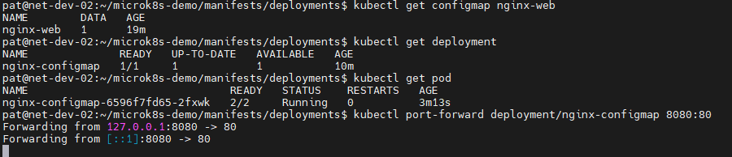
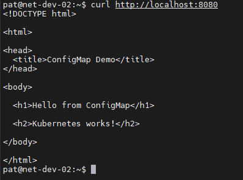
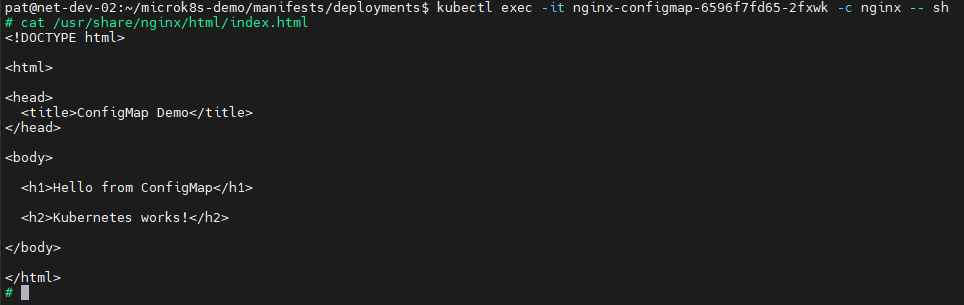
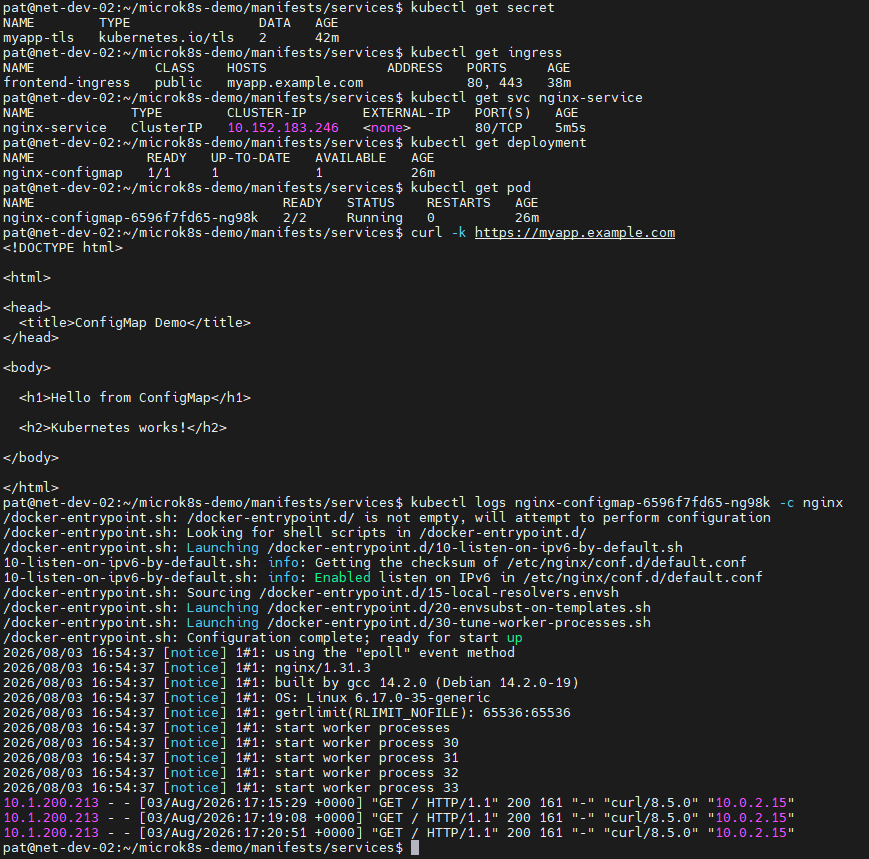

# Домашнее задание к занятию «Настройка приложений и управление доступом в Kubernetes»

## Задание 1: Работа с ConfigMaps
> Развернуть приложение (nginx + multitool), решить проблему конфигурации через ConfigMap и подключить веб-страницу.
> 
> Шаги выполнения:
>
> 1. Создать Deployment с двумя контейнерами:
> * nginx;
> * multitool.
>
> 2. Подключить веб-страницу через ConfigMap;
> 3. Проверить доступность.

## Ответ:

*Создал Deployment, создал Configmap и проверил доступность страницы index.html:*

[deployment.yaml](manifests/deployments/deployment.yaml)
[configmap-web.yaml](manifests/configmaps/configmap-web.yaml)

---

## Задание 2: Настройка HTTPS с Secrets
> Развернуть приложение с доступом по HTTPS, используя самоподписанный сертификат.
>
> Шаги выполнения
> 1. Сгенерировать SSL-сертификат;
> 2. Создать Secret;
> 3. Настроить Ingress;
> 4. Проверить HTTPS-доступ.

## Ответ:

*Создал Secret, Ingress, Service и проверил доступность страницы index.html по https с использованием SSL-сертификата:*

[secret-tls.yaml](manifests/secret/secret-tls.yaml)
[ingress-tls.yaml](manifests/ingress/ingress-tls.yaml)
[nginx-service.yaml](manifests/services/nginx-service.yaml)
