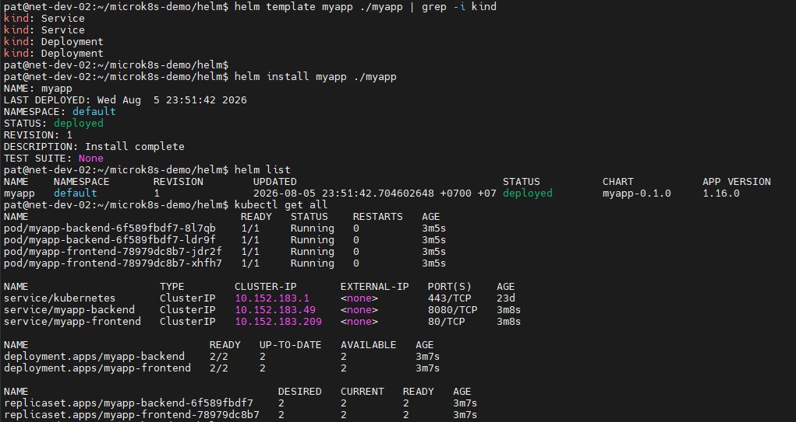
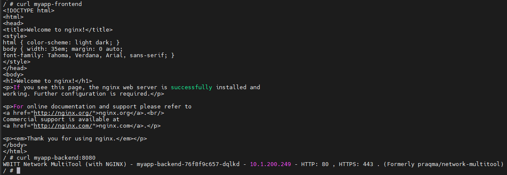
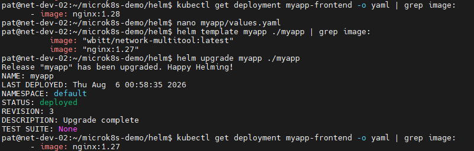

# Домашнее задание к занятию «Helm»

## Задание 1. Подготовить Helm-чарт для приложения
> 1. Необходимо упаковать приложение в чарт для деплоя в разные окружения;
> 2. Каждый компонент приложения деплоится отдельным deployment’ом или statefulset’ом;
> 3. В переменных чарта измените образ приложения для изменения версии.

## Ответ:

> В Chart упакованы приложения для деплоя в разные окружения:
>
> - frontend — nginx
> - backend — wbitt/network-multitool
> 
> Для каждого компонента созданы отдельные Service.
> Каждый компонент приложения деплоится отдельным deployment’ом.
> Выполнил helm instal myapp.



> Выполнена проверка работы приложения:



> В переменных чарта изменил версию образа приложения nginx, выполнил обновление релиза и проверил что версия изменилась:



---

### Структура Helm-чарта приложения:

```bash
$ tree myapp
myapp
├── Chart.yaml
├── templates
│   ├── backend-deployment.yaml
│   ├── backend-service.yaml
│   ├── frontend-deployment.yaml
│   ├── frontend-service.yaml
│   └── _helpers.tpl
└── values.yaml

2 directories, 7 files
```
*Helm-чарт приложения находится в каталоге:*

[myapp Helm Chart](helm/myapp)

---
