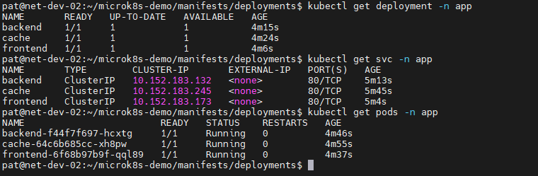
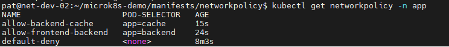
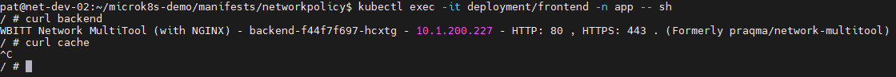
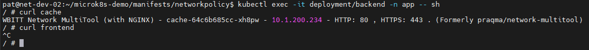
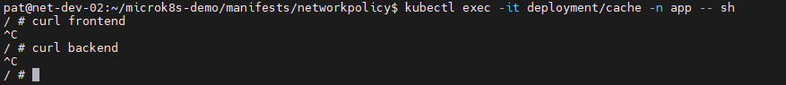

# Домашнее задание к занятию «Как работает сеть в K8s»

## Задание 1. Создать сетевую политику или несколько политик для обеспечения доступа
> 1. Создать deployment'ы приложений frontend, backend и cache и соответсвующие сервисы;
> 2. В качестве образа использовать network-multitool;
> 3. Разместить поды в namespace App;
> 4. Создать политики, чтобы обеспечить доступ frontend -> backend -> cache. Другие виды подключений должны быть запрещены;
> 5. Продемонстрировать, что трафик разрешён и запрещён.

## Ответ:

*1,2,3 Создал deployment'ы, services и расположил их в namespace app.*



[deployment](manifests/deployments)

[services](manifests/services)

*4 Создал политику по умолчанию запрещающий весь трафик в namespace app. Так же создал необходимые разрешающие политики*



[NetworkPolicy](manifests/networkpolicy)

*5 Проверка доступа:*

**Из frontend:**



```
frontend ───► backend    ✅

frontend ───► cache      ❌
```
**Из backend:**



```
backend ───► cache       ✅

backend ───► frontend    ❌
```

**Из cache:**



```
cache ───► frontend   ❌

cache ───► backend    ❌
```
