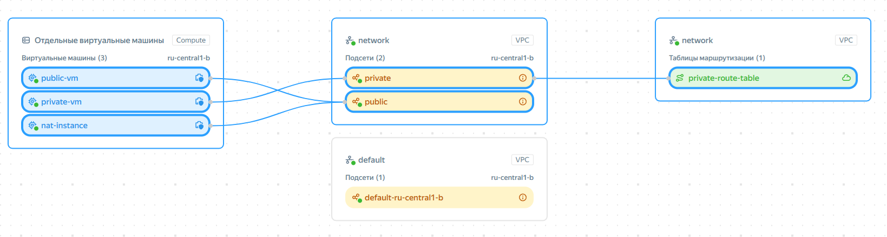
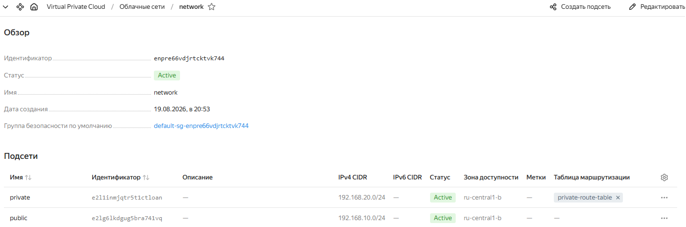
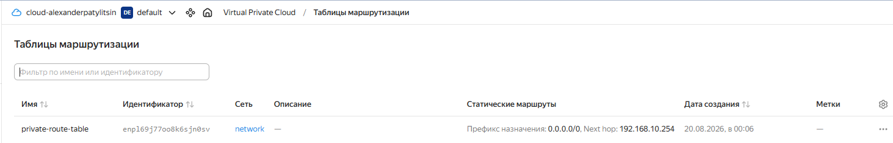
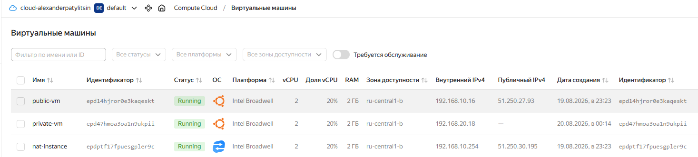
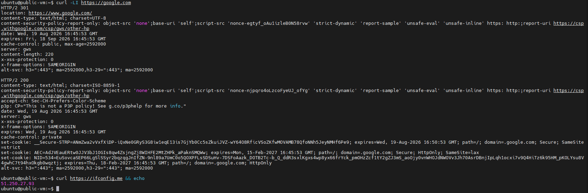
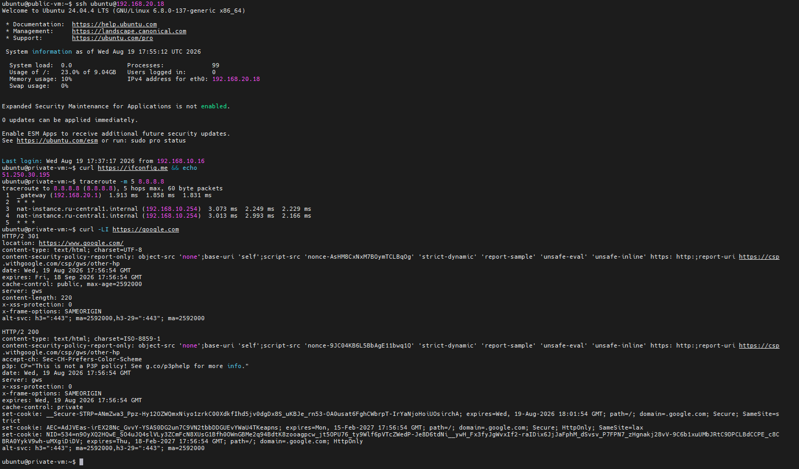

# Домашнее задание к занятию «Организация сети»

## Задание 1. Yandex Cloud

> Что нужно сделать
>
> 1. Создать пустую VPC. Выбрать зону;
> 2. Публичная подсеть:
> * Создать в VPC subnet с названием public, сетью 192.168.10.0/24.
> * Создать в этой подсети NAT-инстанс, присвоив ему адрес 192.168.10.254. В качестве image_id использовать fd80mrhj8fl2oe87o4e1.
> * Создать в этой публичной подсети виртуалку с публичным IP, подключиться к ней и убедиться, что есть доступ к интернету.
> 3. Приватная подсеть:
> * Создать в VPC subnet с названием private, сетью 192.168.20.0/24.
> * Создать route table. Добавить статический маршрут, направляющий весь исходящий трафик private сети в NAT-инстанс.
> * Создать в этой приватной подсети виртуалку с внутренним IP, подключиться к ней через виртуалку, созданную ранее, и убедиться, что есть доступ к интернету.

## Ответ:

*С помощью Terraform собрана небольшая сеть в Yandex Cloud.*

**Созданы:**

- VPC `network`;
- публичная подсеть `public` — `192.168.10.0/24`;
- NAT-инстанс `192.168.10.254`;
- публичная VM с доступом в Интернет;
- приватная подсеть `private` — `192.168.20.0/24`;
- приватная VM без публичного IP;
- Route Table для приватной подсети;
- маршрут в Интернет через NAT-инстанс.

*Карта инфраструктуры:*



*Virtual Private Cloud:*



*Route-table:*



*Virtual machines:*



**Проверено:**

*Основные проверки:*

```
$ terraform validate
Success! The configuration is valid.

$ terraform state list
data.yandex_compute_image.ubuntu
yandex_compute_instance.nat
yandex_compute_instance.private
yandex_compute_instance.public
yandex_vpc_network.network
yandex_vpc_route_table.private
yandex_vpc_subnet.private
yandex_vpc_subnet.public

```

*Доступ в Интернет с публичной VM:*



*Подключение к private VM через public VM. Доступ в Интернет с private VM через NAT:*



### Структура проекта

```text
.
├── images.tf             # Образы виртуальных машин
├── instances.tf          # NAT, public и private виртуальные машины
├── locals.tf             # Локальные значения, SSH-ключ
├── network.tf            # VPC и подсети
├── outputs.tf            # Выходные значения Terraform
├── providers.tf          # Настройка провайдера Yandex Cloud
├── routes.tf             # Route Table и маршруты
├── terraform.tfvars      # Значения переменных
├── variables.tf          # Переменные Terraform
└── versions.tf           # Версии Terraform и провайдера
```
### Исходный код

Исходный код проекта доступен в репозитории:

[terraform-yandex-network](terraform-yandex-network)
