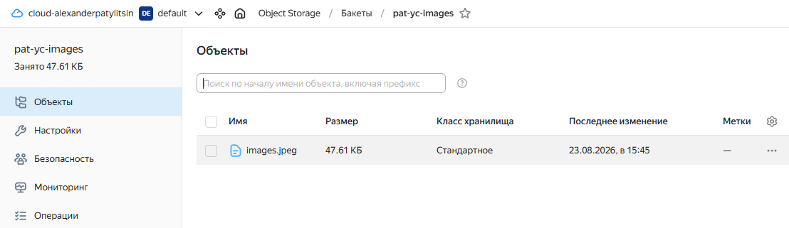
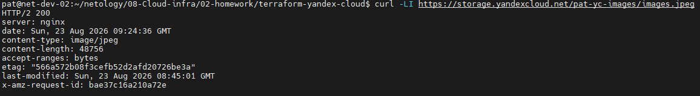
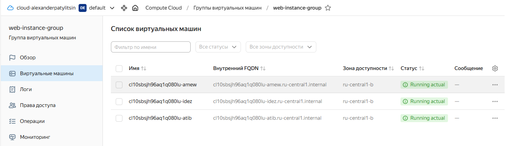
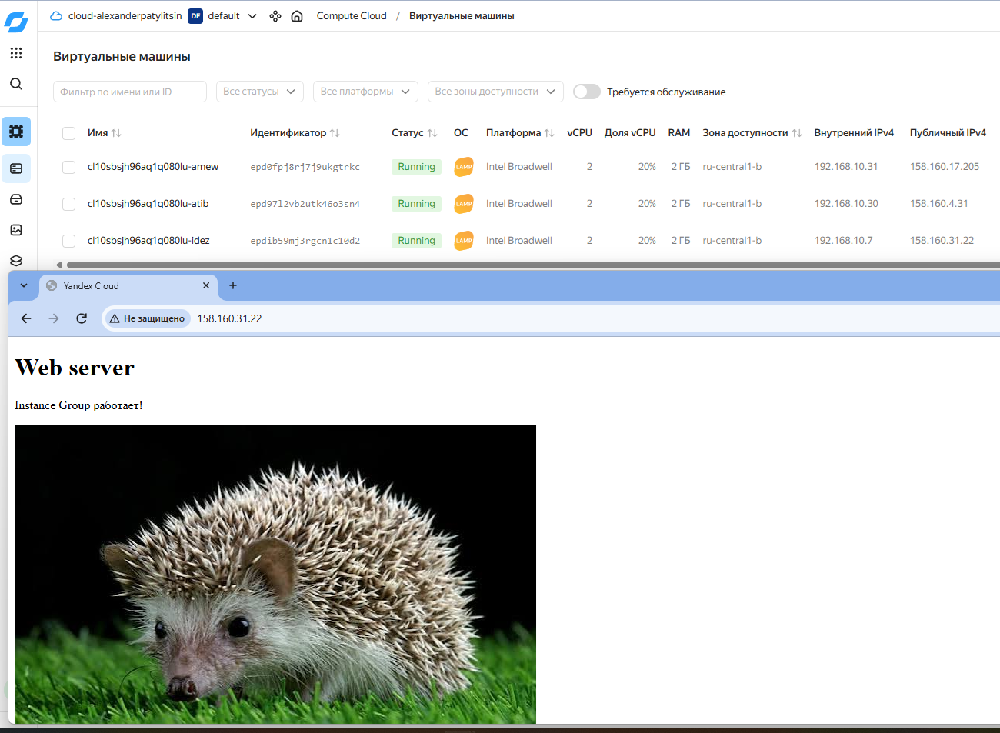
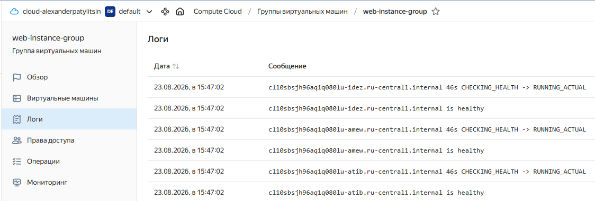
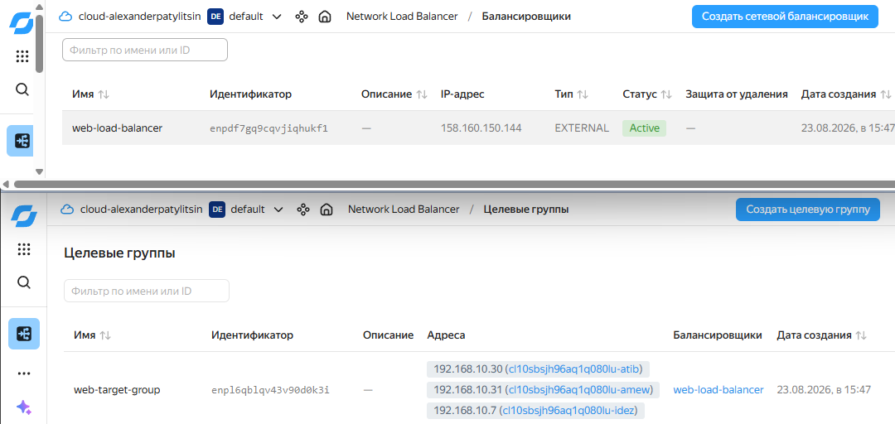
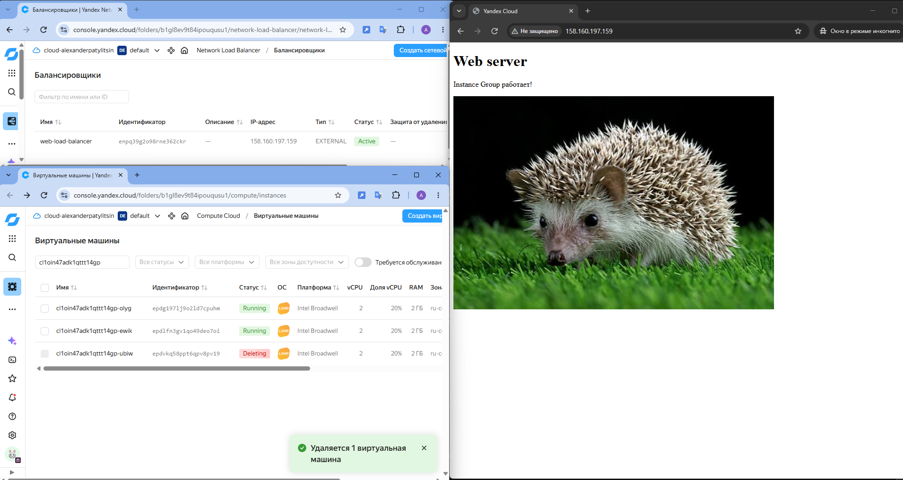
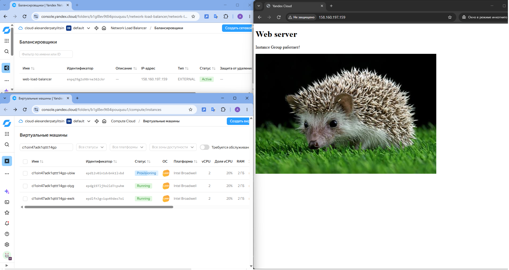
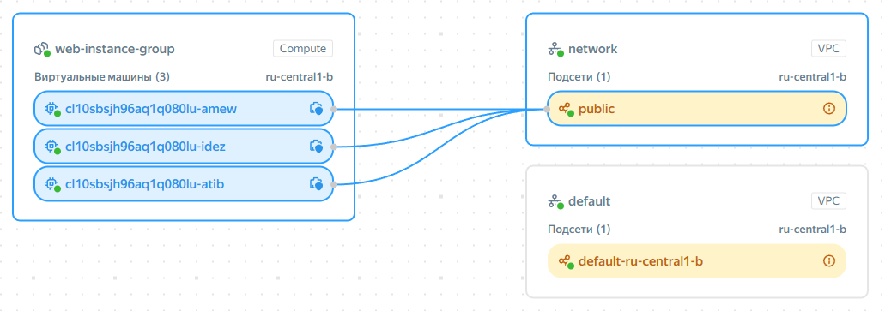

# Домашнее задание к занятию «Вычислительные мощности. Балансировщики нагрузки»

## Задание 1. Yandex Cloud
>
> Что нужно сделать
>
> 1. Создать бакет Object Storage и разместить в нём файл с картинкой:
> * Создать бакет в Object Storage с произвольным именем (например, имя_студента_дата).
> * Положить в бакет файл с картинкой.
> * Сделать файл доступным из интернета.
>
> 2. Создать группу ВМ в public подсети фиксированного размера с шаблоном LAMP и веб-страницей, содержащей ссылку на картинку из бакета:
> * Создать Instance Group с тремя ВМ и шаблоном LAMP. Для LAMP рекомендуется использовать image_id = fd827b91d99psvq5fjit.
> * Для создания стартовой веб-страницы рекомендуется использовать раздел user_data в meta_data.
> * Разместить в стартовой веб-странице шаблонной ВМ ссылку на картинку из бакета.
> * Настроить проверку состояния ВМ.
>
> 3. Подключить группу к сетевому балансировщику:
> * Создать сетевой балансировщик.
> * Проверить работоспособность, удалив одну или несколько ВМ.

## Ответ:

*С помощью Terraform создана веб-инфраструктура в Yandex Cloud:*

**создан Object Storage и загружена картинка:**



**настроен публичный доступ к картинке:**



**создана Instance Group из 3 VM в public subnet:**



**на VM автоматически разворачивается LAMP и веб-страница. Так же отображается картинка из Object Storage:**



**настроена HTTP-проверка состояния VM:**



**создан Network Load Balancer. Instance Group подключена к балансировщику:**



**проверена работа сервиса через IP балансировщика. Проверена отказоустойчивость: при удалении VM группа автоматически создаёт новую:**





### Карта инфраструктуры



### Основные проверки Terraform:

```
$ terraform validate
Success! The configuration is valid.

$ terraform state list
data.yandex_iam_service_account.terraform
yandex_compute_instance_group.web
yandex_lb_network_load_balancer.web
yandex_lb_target_group.web
yandex_storage_bucket.images
yandex_storage_object.image
yandex_vpc_network.network
yandex_vpc_subnet.public
```

### Структура проекта
```
.
├── backet.tf                 # Object Storage и загрузка картинки
├── data.tf                   # Получение данных Yandex Cloud
├── images.tf                 # Образ VM
├── instance_group.tf         # Instance Group из 3 VM
├── load_balancer.tf          # Network Load Balancer и Target Group
├── network.tf                # VPC и public subnet
├── locals.tf                 # Локальные значения
├── outputs.tf                # Выходные значения Terraform
├── providers.tf              # Настройка Yandex Cloud provider
├── variables.tf              # Переменные Terraform
├── versions.tf               # Версии Terraform и provider
├── terraform.tfvars.example  # Пример переменных
└── files/
    └── images.jpeg           # Изображение для Object Storage
```

### Исходный код

Исходный код проекта доступен в репозитории:

[terraform-yandex-cloud](terraform-yandex-cloud)
