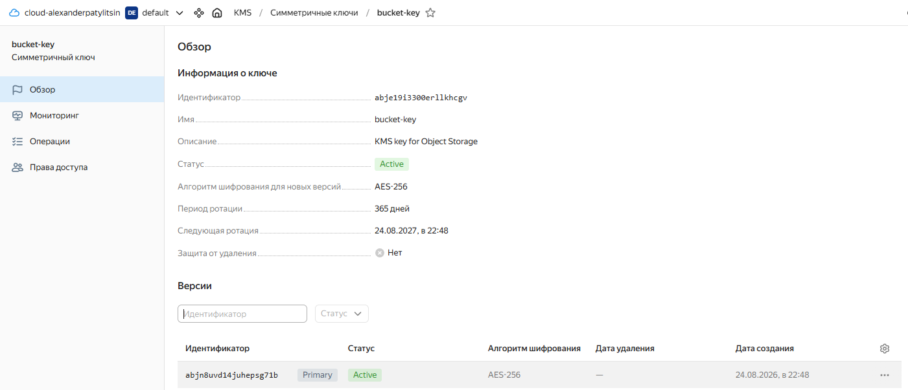
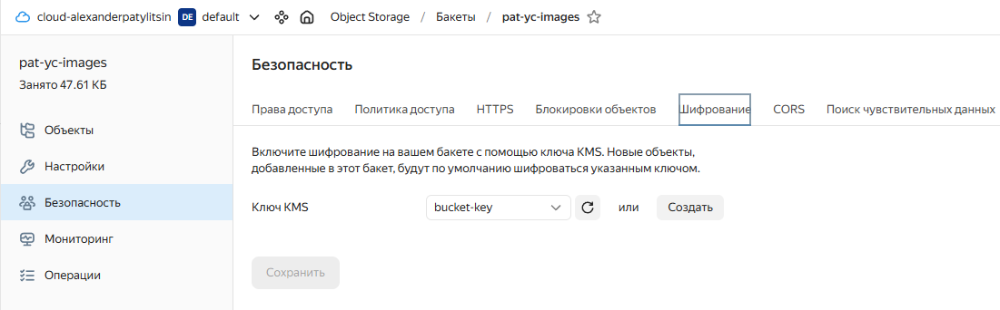
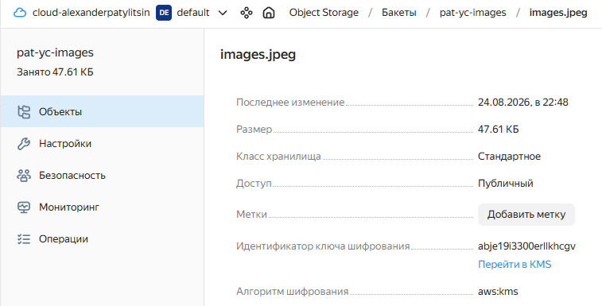

# Домашнее задание к занятию «Безопасность в облачных провайдерах»

## Задание 1. Yandex Cloud
> 1. С помощью ключа в KMS необходимо зашифровать содержимое бакета:
> * создать ключ в KMS;
> * с помощью ключа зашифровать содержимое бакета, созданного ранее.

## Ответ:

*С помощью Terraform:*

**создан симметричный ключ в Yandex Key Management Service (KMS):**



**создан Object Storage bucket pat-yc-images:**



**настроено серверное шифрование объектов с использованием KMS и AES-256:**



**проверено, что объект продолжает быть доступен через интернет и использует шифрование:**

```
$ curl -I https://storage.yandexcloud.net/pat-yc-images/images.jpeg
HTTP/2 200
server: nginx
date: Mon, 24 Aug 2026 16:02:47 GMT
content-type: image/jpeg
content-length: 48756
accept-ranges: bytes
etag: "566a572b08f3cefb52d2afd20726be3a"
last-modified: Mon, 24 Aug 2026 15:48:29 GMT
x-amz-request-id: 37f828235da2f33b
x-amz-server-side-encryption: aws:kms
x-amz-server-side-encryption-aws-kms-key-id: abje19i3300erllkhcgv
```

### Основные проверки Terraform:

```
$ terraform validate
Success! The configuration is valid.

$ terraform state list
yandex_kms_symmetric_key.bucket
yandex_storage_bucket.images
yandex_storage_object.image
```

### Структура проекта

```
.
├── bucket.tf                 # Object Storage и настройка шифрования
├── kms.tf                    # KMS-ключ
├── files/
│   └── images.jpeg           # Файл для загрузки в Object Storage
├── providers.tf              # Настройка Yandex Cloud provider
├── terraform.tfvars.example  # Пример переменных
├── variables.tf              # Переменные Terraform
└── versions.tf               # Версии Terraform и provider
```

### Исходный код

Исходный код проекта доступен в репозитории:

[terraform-yandex-kms](terraform-yandex-kms)
